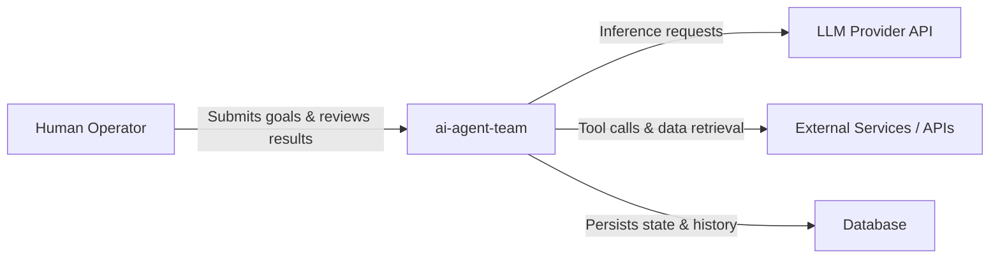
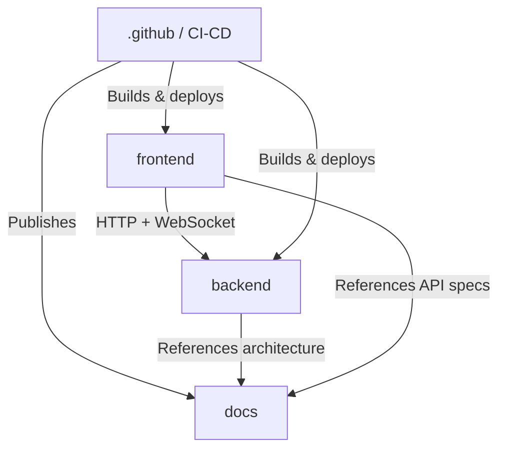
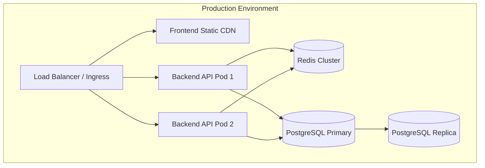

# Architecture

> System-level view of **ai-agent-team** — how it is organized, why those decisions were made, and how the pieces fit together. Each module has its own detailed architecture page.

---

## Table of Contents

- [System Overview](#system-overview)
- [Module Map](#module-map)
- [Technology Stack](#technology-stack)
- [Key Architectural Patterns](#key-architectural-patterns)
- [Module Dependency Graph](#module-dependency-graph)
- [Deployment Overview](#deployment-overview)
- [Cross-Cutting Concerns](#cross-cutting-concerns)
- [Architecture Decision Records](#architecture-decision-records)

---

## System Overview

**ai-agent-team** is a collaborative AI agent platform that orchestrates multiple specialized AI agents working in concert to complete complex, multi-step tasks. The system exposes a web-based frontend for human operators to define goals, monitor agent activity, and review outputs, while a backend runtime manages agent lifecycles, tool execution, inter-agent communication, and integration with external LLM providers and third-party services.



**Boundary:** Inside the system boundary are the frontend UI, the backend API server, the agent orchestration runtime, task and memory management, and the CI/CD pipeline configuration. Outside the boundary are LLM provider APIs (e.g., OpenAI, Anthropic), third-party tool integrations, cloud infrastructure provisioning, and identity providers.

**Primary responsibilities:**
- Accept high-level goals from human operators and decompose them into agent-executable tasks.
- Orchestrate a team of specialized AI agents, routing tasks and managing inter-agent communication.
- Manage agent memory, context windows, and intermediate results across multi-step workflows.
- Provide a real-time UI for monitoring agent progress, inspecting reasoning traces, and intervening in active runs.
- Enforce safety constraints, rate limits, and cost controls on LLM API consumption.

**Explicitly out of scope:**
- Training or fine-tuning LLM models — the system is purely inference-time.
- Hosting or managing LLM infrastructure; all model inference is delegated to external providers.
- General-purpose user authentication identity management; an external identity provider is assumed.
- Long-term archival storage or analytics warehousing of historical agent runs.

---

## Module Map

| Module | Path | Responsibility | Key Interfaces | Reference |
|--------|------|---------------|----------------|-----------|
| **.github** | `.github/` | CI/CD pipeline definitions, issue and PR templates, repository automation workflows. | GitHub Actions event hooks; branch protection rules | [Details](./docs/architecture/.github.md) |
| **backend** | `backend/` | API server, agent orchestration runtime, tool registry, memory management, LLM provider adapters, and data persistence. | REST/WebSocket API consumed by frontend; outbound HTTP to LLM providers and external tools | [Details](./docs/architecture/backend.md) |
| **docs** | `docs/` | Project documentation, architecture decision records, API references, and developer guides. | Static site generation; links referenced from README and CI checks | [Details](./docs/architecture/docs.md) |
| **frontend** | `frontend/` | Web-based operator UI for submitting goals, monitoring live agent activity, inspecting reasoning traces, and reviewing outputs. | HTTP/WebSocket client to backend API; browser runtime | [Details](./docs/architecture/frontend.md) |

---

## Technology Stack

| Layer | Technology | Version | Purpose | Decision Rationale |
|-------|-----------|---------|---------|-------------------|
| Frontend Framework | React | `^18` | Component-based operator UI with reactive state management | Large ecosystem, strong TypeScript support, concurrent rendering for real-time agent streams |
| Frontend Language | TypeScript | `^5` | Type-safe frontend development | Catches interface mismatches between frontend and backend API contracts at compile time |
| Frontend Build | Vite | `^5` | Fast dev server and production bundling | Significantly faster HMR than webpack; native ESM support |
| Backend Runtime | Node.js | `^20 LTS` | Server-side JavaScript execution environment | Unified language across frontend and backend reduces context switching; strong async I/O for concurrent agent tasks |
| Backend Framework | Express / Fastify | `^4 / ^4` | HTTP and WebSocket API server | Lightweight, well-understood, easy to add middleware for auth and observability |
| Backend Language | TypeScript | `^5` | Type-safe backend development | Shared type definitions with frontend via a common types package |
| Agent Orchestration | LangChain / Custom Runtime | `latest` | Agent loop, tool dispatch, and chain composition | Provides a structured abstraction over LLM calls and tool use; custom extensions for multi-agent coordination |
| Database | PostgreSQL | `^16` | Persistent storage for agent runs, task graphs, memory, and audit logs | ACID compliance critical for reliable task state; JSONB columns support semi-structured agent memory |
| Cache / Message Bus | Redis | `^7` | Session caching, real-time pub/sub for agent event streaming to frontend | Low-latency pub/sub fits the live agent monitoring use case; doubles as a distributed lock provider |
| CI/CD | GitHub Actions | `N/A` | Automated lint, test, build, and deployment pipelines | Native integration with repository; no additional CI infrastructure to manage |
| Containerization | Docker | `^25` | Reproducible build and deployment artifacts | Consistent environments across dev, staging, and production |
| Container Orchestration | Docker Compose / Kubernetes | `v2 / ^1.28` | Local multi-service dev environment and production workload scheduling | Compose for developer ergonomics; Kubernetes for production scalability |

---

## Key Architectural Patterns

Patterns used consistently across the codebase. Understanding these patterns is a prerequisite for navigating the module-level documentation.

### Agent Loop with Tool Dispatch

**What:** Each agent executes a think → act → observe cycle. The agent reasons about its current state using an LLM, selects a tool from the registry, executes the tool, observes the result, and iterates until a termination condition is met.

**Where:** Backend `agent-runtime` and `tool-registry` sub-modules.

**Why:** Decouples reasoning (LLM calls) from action (tool execution), making it straightforward to add new tools without modifying core agent logic. The trade-off is that multi-step loops can accumulate latency and token cost.

**Example:**

```typescript
async function agentLoop(agent: Agent, goal: string): Promise<AgentResult> {
  let context = agent.initContext(goal);

  while (!context.isTerminated()) {
    const thought = await llm.reason(context.toPrompt());
    const toolCall = parseToolCall(thought);

    if (!toolCall) {
      context.terminate(thought.finalAnswer);
      break;
    }

    const observation = await toolRegistry.execute(toolCall);
    context.addObservation(toolCall, observation);
  }

  return context.result();
}
```

### Event-Driven Agent State Streaming

**What:** Agent lifecycle events (task started, tool called, observation received, task completed, error) are published to a Redis pub/sub channel and streamed to connected frontend clients over WebSocket.

**Where:** Backend `event-bus` module; frontend `agent-monitor` components.

**Why:** Keeps the UI decoupled from the backend execution loop — the backend never calls the frontend directly. This also enables multiple concurrent observers (e.g., operator UI and audit logging) subscribing to the same event stream. The trade-off is eventual consistency; the UI reflects events slightly after they occur.

---

### Repository Pattern for Persistence

**What:** All database access is mediated through repository interfaces. Concrete implementations use the underlying ORM or query builder; consumers depend only on the interface.

**Where:** Backend data-access layer across all domain entities (runs, tasks, agents, memory).

**Why:** Isolates domain logic from persistence technology, enables straightforward unit testing with in-memory fakes, and makes future storage migrations lower risk. The trade-off is additional boilerplate for each entity.

---

## Module Dependency Graph



**Key constraints:**
- The `frontend` module never imports backend source code directly; all communication is over the published HTTP/WebSocket API contract.
- The `backend` module has no knowledge of frontend rendering logic or component structure.
- The `.github` module depends on all other modules only at the pipeline invocation level — it triggers builds but does not import source code.
- The `docs` module is a pure consumer of information; no other module imports from it at runtime.

**Circular dependency policy:** Circular dependencies between modules are strictly forbidden and enforced by CI lint checks (e.g., `dependency-cruiser`). Within the backend, intra-package circular imports are detected and blocked at build time via TypeScript project references. Any proposed dependency that would introduce a cycle must be resolved by extracting a shared interface or common sub-package before merging.

---

## Deployment Overview



### Environments

| Environment | Purpose | Infrastructure | Deployment Trigger |
|-------------|---------|---------------|-------------------|
| Development | Local developer iteration; full stack via Docker Compose | Docker Compose on developer workstation | Manual (`docker compose up`) |
| Staging | Pre-production integration testing; mirrors production topology at reduced scale | Kubernetes cluster (single-region); ephemeral namespaces per PR | Automated on merge to `main` branch |
| Production | Live system serving real operator workloads | Kubernetes cluster (multi-zone); managed PostgreSQL and Redis; CDN for frontend assets | Manual promotion gate after staging sign-off |

### Build & Release Pipeline

The pipeline is defined in `.github/workflows/` and proceeds through the following stages:

1. **Trigger:** Pull request opened or updated against `main`; or direct push to `main`.
2. **Lint & Type Check:** ESLint, TypeScript compiler (`tsc --noEmit`) run in parallel for `frontend` and `backend`.
3. **Unit Tests:** Jest test suites for both modules; coverage thresholds enforced.
4. **Integration Tests:** Backend integration tests run against a Dockerized PostgreSQL and Redis instance spun up in the GitHub Actions job.
5. **Build Artifacts:** Docker images built for backend; Vite production bundle built for frontend. Images tagged with commit SHA and pushed to container registry.
6. **Staging Deploy:** Rolling deployment to staging Kubernetes namespace using the newly built images. Smoke tests run post-deploy.
7. **Production Promotion Gate:** Requires explicit manual approval from a designated reviewer in GitHub Environments.
8. **Production Deploy:** Blue-green deployment strategy — new version brought up alongside the current version; traffic shifted after health checks pass; old version torn down.

---

## Cross-Cutting Concerns

| Concern | Strategy | Enforcement Point | Reference |
|---------|----------|-------------------|-----------|
| Error Handling | Typed error classes with explicit error codes; all async boundaries wrapped with structured try/catch; unhandled rejections terminate the process with a logged trace | Backend middleware layer; frontend API client interceptors | [backend architecture](./docs/architecture/backend.md) |
| Logging | Structured JSON logging via `pino`; log level controlled by environment variable; correlation IDs propagated through request context | Backend request middleware; injected logger in all service classes | [backend architecture](./docs/architecture/backend.md) |
| Authentication | JWT bearer tokens issued by an external identity provider; validated on every backend API request via middleware | Backend authentication middleware (applied globally, with explicit opt-out for public routes) | [backend architecture](./docs/architecture/backend.md) |
| Authorization | Role-based access control (RBAC); roles attached to JWT claims; permission checks enforced in service layer, not just route handlers | Backend service layer; roles: `operator`, `viewer`, `admin` | [backend architecture](./docs/architecture/backend.md) |
| Caching | Redis-backed cache for LLM response deduplication and session data; cache-aside pattern; TTLs set per resource type | Backend `cache` service module | [backend architecture](./docs/architecture/backend.md) |
| Observability | Distributed tracing via OpenTelemetry SDK; metrics exported to Prometheus; dashboards in Grafana; alerting on error rate and p95 latency | Backend OpenTelemetry instrumentation; sidecar collectors in Kubernetes pods | [backend architecture](./docs/architecture/backend.md) |
| Configuration | Environment variables as the sole configuration mechanism; validated at startup using a schema (e.g., `zod`); no hardcoded secrets in source | Backend startup validation; `.env.example` documents all required variables; secrets injected via Kubernetes Secrets | [backend architecture](./docs/architecture/backend.md) |

---

## Architecture Decision Records

Index of all ADRs. Each module page may contain module-specific decisions; this index captures system-wide decisions.

| ADR | Title | Status | Date | Summary |
|-----|-------|--------|------|---------|
| ADR-001 | Adopt TypeScript across frontend and backend | Accepted | 2024-01-10 | A single language with shared type definitions reduces the surface area for API contract drift and lowers onboarding cost for contributors switching between layers. |
| ADR-002 | Use Redis pub/sub for agent event streaming | Accepted | 2024-01-18 | WebSocket connections managed by multiple backend pods require a shared message bus so any pod can fan out events to any connected client. Redis pub/sub was chosen over Kafka for operational simplicity at current scale. |
| ADR-003 | Delegate LLM inference to external providers | Accepted | 2024-01-18 | Self-hosting LLMs is outside the project's operational scope and cost model. The provider adapter pattern isolates this dependency so providers can be swapped or extended without modifying core agent logic. |
| ADR-004 | Blue-green deployment for production releases | Accepted | 2024-02-05 | Agent runs in flight must not be disrupted by a deployment. Blue-green allows the current version to drain active connections gracefully before the old environment is retired, avoiding mid-run failures. |
| ADR-005 | Enforce no-circular-dependency rule via CI | Accepted | 2024-02-14 | Early prototyping introduced several unintentional circular imports that caused subtle initialization ordering bugs. `dependency-cruiser` rules added to CI prevent recurrence without requiring manual review discipline. |
| ADR-006 | PostgreSQL with JSONB for agent memory storage | Accepted | 2024-03-01 | Agent memory is semi-structured and evolves rapidly during development. JSONB provides schema flexibility while retaining the ACID guarantees and query capabilities needed for reliable task state management. A pure document store was considered but rejected to avoid introducing a second database technology. |
| ADR-007 | Repository pattern for all data access | Accepted | 2024-03-08 | Direct ORM usage scattered across service classes made unit testing difficult and created implicit coupling to the database schema. Repository interfaces allow service tests to run against in-memory fakes without a live database. |

### ADR Format

Each ADR follows this structure:

- **Status:** Accepted / Proposed / Deprecated / Superseded by ADR-N
- **Date:** YYYY-MM-DD
- **Context:** The situation and forces at play.
- **Decision:** What was decided and why.
- **Consequences:** Positive, negative, and neutral impacts.