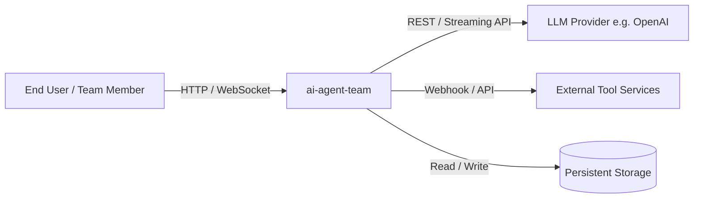
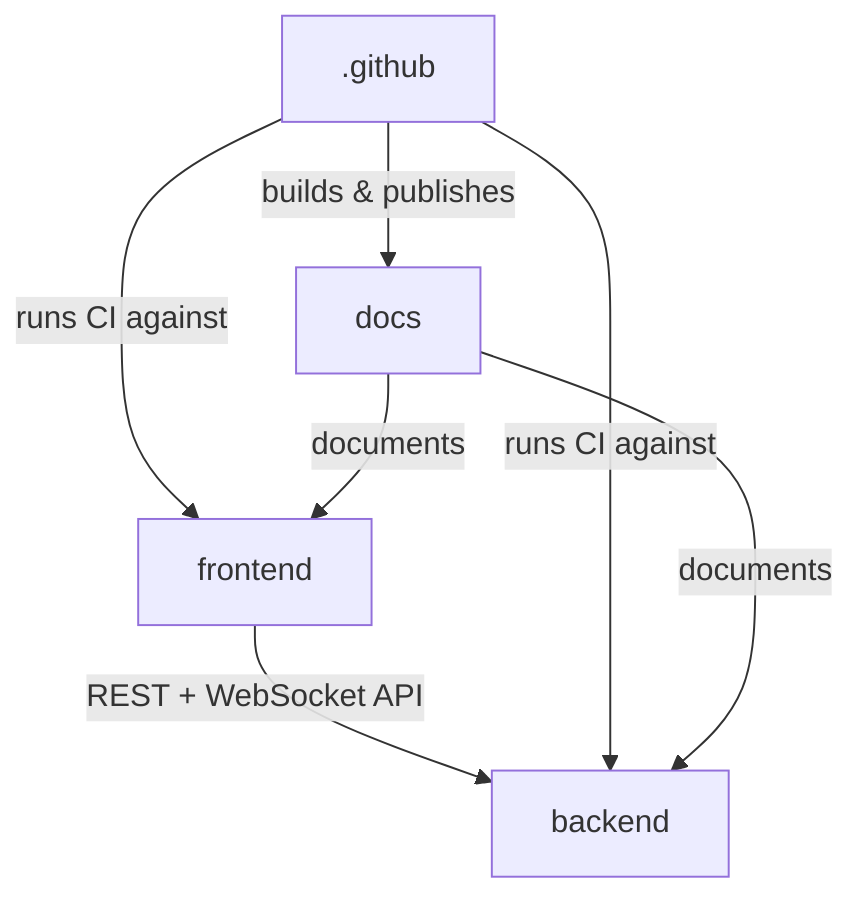
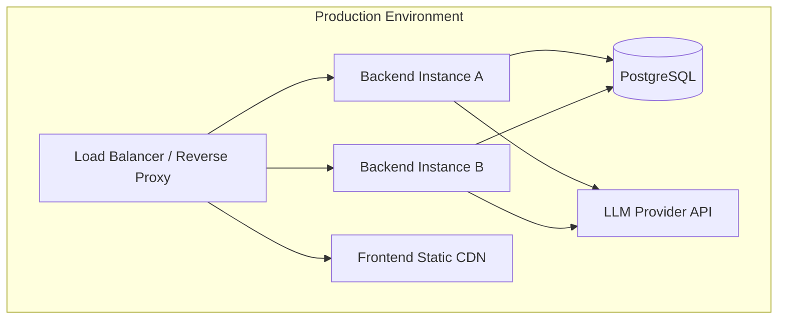

# Architecture

> System-level view of **ai-agent-team** — how it is organized, why those decisions were made, and how the pieces fit together. Each module has its own detailed architecture page.

---

## Table of Contents

- [System Overview](#system-overview)
- [Module Map](#module-map)
- [Technology Stack](#technology-stack)
- [Key Architectural Patterns](#key-architectural-patterns)
- [Module Dependency Graph](#module-dependency-graph)
- [Deployment Overview](#deployment-overview)
- [Cross-Cutting Concerns](#cross-cutting-concerns)
- [Architecture Decision Records](#architecture-decision-records)

---

## System Overview

**ai-agent-team** is a collaborative AI agent orchestration platform that enables teams to define, deploy, and coordinate multiple AI agents working together toward complex goals. The system exposes a web-based interface for authoring agent workflows, a backend API for runtime orchestration, and integrates with external LLM providers and tool services.



**Boundary:** Inside the system — the frontend SPA, the backend API server, agent orchestration logic, workflow state management, and CI/CD automation. Outside the system — LLM model inference infrastructure, third-party tool APIs, identity providers, and cloud hosting infrastructure.

**Primary responsibilities:**
- Accept user-defined agent team configurations and workflow specifications.
- Orchestrate multi-agent execution loops, including task delegation, tool invocation, and inter-agent messaging.
- Persist workflow state, run history, and agent outputs for auditability and resumption.
- Expose a real-time UI for monitoring agent activity, reviewing outputs, and intervening in running workflows.
- Provide CI/CD automation for consistent testing and deployment of the platform itself.

**Explicitly out of scope:**
- Training or fine-tuning AI models — the system consumes model APIs only.
- Hosting or managing LLM inference compute.
- General-purpose task management or project management features beyond agent workflow coordination.
- End-user authentication identity management (delegated to an external identity provider).

---

## Module Map

| Module | Path | Responsibility | Key Interfaces | Reference |
|--------|------|---------------|----------------|-----------|
| **.github** | `.github/` | CI/CD pipeline definitions, GitHub Actions workflows, issue and PR templates, repository automation. | GitHub Actions event triggers; workflow YAML files consumed by GitHub runners. | [Details](./docs/architecture/.github.md) |
| **backend** | `backend/` | API server, agent orchestration engine, LLM provider integration, tool execution, workflow state management, and data persistence. | REST/WebSocket API consumed by the frontend; outbound HTTP to LLM providers and tool services; database read/write. | [Details](./docs/architecture/backend.md) |
| **docs** | `docs/` | Project documentation, architecture decision records, API references, and developer guides. | Rendered as static documentation site; consumed by contributors and operators. | [Details](./docs/architecture/docs.md) |
| **frontend** | `frontend/` | Single-page web application for authoring agent workflows, monitoring live runs, reviewing outputs, and managing team configuration. | Consumes backend REST and WebSocket API; rendered in user browsers. | [Details](./docs/architecture/frontend.md) |

---

## Technology Stack

| Layer | Technology | Version | Purpose | Decision Rationale |
|-------|-----------|---------|---------|-------------------|
| Frontend Framework | React | `^18` | Component-based UI for the agent workflow interface. | Mature ecosystem, strong TypeScript support, large talent pool. |
| Frontend Language | TypeScript | `^5` | Type-safe development across the frontend codebase. | Catches interface mismatches early, especially critical for API contract alignment. |
| Frontend Build | Vite | `^5` | Fast development server and production bundling. | Significantly faster HMR than Webpack; native ESM support. |
| Backend Runtime | Node.js | `^20 LTS` | Server-side JavaScript runtime for the API and orchestration engine. | Enables code sharing with the frontend; strong async I/O for streaming LLM responses. |
| Backend Framework | Express / Fastify | `^4 / ^4` | HTTP API routing and middleware. | Lightweight and well-understood; easy integration with streaming and WebSocket upgrades. |
| Backend Language | TypeScript | `^5` | Type safety across the backend, especially for agent message schemas. | Shared type definitions between frontend and backend reduce integration bugs. |
| Database | PostgreSQL | `^15` | Persistent storage for workflow state, run history, agent configs, and outputs. | Reliable ACID transactions for workflow state; JSONB columns for flexible agent payloads. |
| ORM / Query | Prisma | `^5` | Type-safe database access and schema migrations. | Auto-generated types from schema reduce manual mapping; migration workflow is team-friendly. |
| LLM Integration | OpenAI SDK / LangChain | `latest` | Abstraction for LLM provider calls and agent tool-use patterns. | LangChain provides reusable agent loop primitives; OpenAI SDK covers the primary model provider. |
| Real-time | WebSocket (ws) | `^8` | Push agent run events and streaming output to the frontend. | Required for low-latency display of streaming LLM tokens and agent status changes. |
| CI/CD | GitHub Actions | `N/A` | Automated testing, linting, building, and deployment. | Native GitHub integration; no additional CI infrastructure to manage. |
| Containerisation | Docker | `^24` | Reproducible build and runtime environments for backend services. | Eliminates environment drift between development, staging, and production. |
| Package Manager | pnpm | `^8` | Monorepo-aware dependency management with workspace support. | Faster installs and strict dependency isolation compared to npm; native workspace hoisting control. |

---

## Key Architectural Patterns

Patterns used consistently across the codebase. Understanding these patterns is a prerequisite for navigating the module-level documentation.

### Agent Orchestration Loop

**What:** A recurring request–respond–act cycle in which an orchestrator sends a prompt to an LLM, receives a response, parses any tool-call instructions, executes the nominated tools, appends results to the conversation context, and repeats until a termination condition is met.

**Where:** `backend/` — the orchestration engine and agent runner modules.

**Why:** This pattern encapsulates the core LLM interaction model (ReAct / function-calling style) into a single, testable loop. It separates concerns between prompt construction, model I/O, tool dispatch, and state persistence, making it straightforward to swap LLM providers or add new tools without rewriting the control flow.

**Example:**

```typescript
async function runAgentLoop(ctx: AgentContext): Promise<AgentResult> {
  while (!ctx.isTerminated()) {
    const response = await llmClient.chat(ctx.buildMessages());
    const toolCalls = parseToolCalls(response);

    if (toolCalls.length === 0) {
      return { output: response.content, history: ctx.history };
    }

    for (const call of toolCalls) {
      const result = await toolRegistry.execute(call.name, call.args);
      ctx.appendToolResult(call.id, result);
    }

    ctx.appendAssistantMessage(response);
  }

  return { output: ctx.lastAssistantContent(), history: ctx.history };
}
```

### Event-Driven Run Streaming

**What:** Backend agent run events (token chunks, tool calls, status transitions, errors) are published to an internal event emitter and fanned out to connected WebSocket clients subscribed to a given run ID.

**Where:** `backend/` orchestration layer → WebSocket gateway; `frontend/` real-time run monitor.

**Why:** Decouples the orchestration engine from transport concerns. The engine emits domain events regardless of how many clients are connected; the gateway handles subscription management and back-pressure. This also makes it straightforward to add secondary consumers (e.g., audit logging, analytics) without touching orchestration code.

---

### Shared Type Contracts

**What:** TypeScript interfaces for API request/response shapes, agent message schemas, and workflow configuration objects are defined in a shared package and imported by both `frontend/` and `backend/`.

**Where:** Shared types package (within the pnpm workspace), consumed across `frontend/` and `backend/`.

**Why:** Eliminates the class of bugs where the frontend and backend disagree on a field name or type. A breaking change to an API shape becomes a compile-time error in both packages simultaneously, surfaced in CI before it reaches review.

---

## Module Dependency Graph



**Key constraints:**
- `frontend` depends on `backend` only through the published HTTP/WebSocket API contract — never via direct code import. Shared types are the only permitted compile-time coupling between the two.
- `backend` has no dependency on `frontend` code whatsoever.
- `.github` workflows depend on both `backend` and `frontend` at the CI level (invoking their test and build scripts) but introduce no runtime coupling.
- `docs` is a consumer of information from all modules but introduces no runtime or compile-time dependency on any of them.

**Circular dependency policy:** Circular dependencies between modules are prohibited. Within `backend/`, internal layer rules (e.g., orchestration layer must not import from the HTTP transport layer) are enforced via ESLint import rules configured in the backend package. Violations fail the CI lint stage.

---

## Deployment Overview



### Environments

| Environment | Purpose | Infrastructure | Deployment Trigger |
|-------------|---------|---------------|-------------------|
| Development | Local development and feature iteration | Docker Compose on developer machines | Manual (`pnpm dev`) |
| Staging | Integration testing, QA, and pre-release validation | Containerised deployment on cloud VM / PaaS (mirrors production topology) | Merge to `main` branch via GitHub Actions |
| Production | Live system serving end users | Cloud-hosted containers behind a load balancer with managed PostgreSQL | Tagged release (`v*`) via GitHub Actions with manual approval gate |

### Build & Release Pipeline

The CI/CD pipeline is defined entirely in `.github/workflows/`.

**Trigger:** Pull request (lint, type-check, test) and push to `main` or a release tag (full build + deploy).

**Stages:**
1. **Lint & Format** — ESLint and Prettier checks across `backend/` and `frontend/`.
2. **Type Check** — `tsc --noEmit` for both packages, ensuring shared type contracts hold.
3. **Unit & Integration Tests** — Vitest (frontend) and Jest/Vitest (backend); database integration tests run against an ephemeral PostgreSQL container via Docker service.
4. **Build** — Vite production build for frontend; TypeScript compile + Docker image build for backend.
5. **Staging Deploy** — Automated push to staging on merge to `main`.
6. **Smoke Tests** — Automated health-check and critical-path API tests against the staging environment.
7. **Production Deploy** — Triggered on release tag, gated by a required manual approval in GitHub Actions environments.

**Deployment strategy:** Rolling update — new backend containers are started and health-checked before old containers are drained, ensuring zero-downtime deploys. Frontend assets are deployed atomically to CDN with cache invalidation on the new asset hash.

---

## Cross-Cutting Concerns

| Concern | Strategy | Enforcement Point | Reference |
|---------|----------|-------------------|-----------|
| Error Handling | Errors are classified into domain errors (typed, recoverable) and unexpected errors (logged, converted to 500 responses). Agent tool errors are captured and fed back into the orchestration loop rather than crashing the run. | Backend error-handling middleware; agent loop catch boundaries. | [backend.md](./docs/architecture/backend.md) |
| Logging | Structured JSON logging via `pino` (backend). Log level controlled by environment variable. Sensitive fields (API keys, user content) are redacted at the logger configuration level. | Backend logger singleton injected through request context. | [backend.md](./docs/architecture/backend.md) |
| Authentication | JWT-based authentication issued by an external identity provider. The backend validates tokens on every request via middleware before routing. | Backend authentication middleware (applied globally, with explicit opt-out for public endpoints). | [backend.md](./docs/architecture/backend.md) |
| Authorization | Role-based access control (RBAC) — roles are embedded in JWT claims and checked by resource-level guards in the backend. | Backend route-level and service-level authorization guards. | [backend.md](./docs/architecture/backend.md) |
| Caching | Short-lived in-memory caching for LLM provider model lists and tool manifests. Workflow run results are not cached — always read from the database for consistency. | Backend service layer; cache TTL configured via environment variables. | [backend.md](./docs/architecture/backend.md) |
| Observability | Structured logs (pino), HTTP request tracing via correlation IDs propagated through headers and logs, and health-check endpoints (`/health`, `/ready`) for infrastructure probes. | Backend middleware (correlation ID injection); deployment health checks. | [backend.md](./docs/architecture/backend.md) |
| Configuration | All environment-specific configuration (API keys, DB URLs, feature flags) is supplied via environment variables. No secrets are committed to source control. Validated at startup using a schema (e.g., `zod`) — the process exits immediately if required variables are missing or malformed. | Backend startup configuration module; `.env.example` files document required variables. | [backend.md](./docs/architecture/backend.md) |

---

## Architecture Decision Records

Index of all ADRs. Each module page may contain module-specific decisions; this index captures system-wide decisions.

| ADR | Title | Status | Date | Summary |
|-----|-------|--------|------|---------|
| ADR-001 | Monorepo with pnpm Workspaces | Accepted | 2024-01-15 | All packages (`frontend`, `backend`, `docs`) live in a single repository managed by pnpm workspaces, enabling shared types and unified CI without the complexity of a multi-repo setup. |
| ADR-002 | TypeScript Across the Full Stack | Accepted | 2024-01-15 | TypeScript is used in both `frontend` and `backend` to enable shared type definitions for API contracts and agent message schemas, reducing integration bugs. |
| ADR-003 | PostgreSQL with Prisma ORM | Accepted | 2024-01-20 | PostgreSQL provides ACID guarantees for workflow state. Prisma is chosen for type-safe query generation and a managed migration workflow. MongoDB was considered but rejected due to the need for transactional integrity across workflow state transitions. |
| ADR-004 | WebSocket for Agent Run Streaming | Accepted | 2024-01-22 | WebSocket is used over Server-Sent Events (SSE) for streaming agent run events because bi-directional communication (user interrupts, pause/resume signals) is required in addition to server-to-client streaming. |
| ADR-005 | External Identity Provider for Authentication | Accepted | 2024-02-01 | Authentication is fully delegated to an external identity provider (issuing JWTs). The system validates tokens but never stores passwords, reducing the security surface area and implementation burden. |
| ADR-006 | LangChain as Agent Loop Abstraction | Proposed | 2024-02-10 | LangChain provides reusable primitives for the agent orchestration loop and tool integration. Under review — the team is evaluating whether the abstraction overhead justifies the dependency versus a leaner in-house implementation. |
| ADR-007 | Rolling Deployment with Zero-Downtime Requirement | Accepted | 2024-02-15 | Production deployments use rolling updates rather than blue-green to reduce infrastructure cost. The backend is designed to be stateless (session state in DB) so any instance can serve any request during a rollout. |

### ADR Format

Each ADR follows this structure:

- **Status:** Accepted / Proposed / Deprecated /