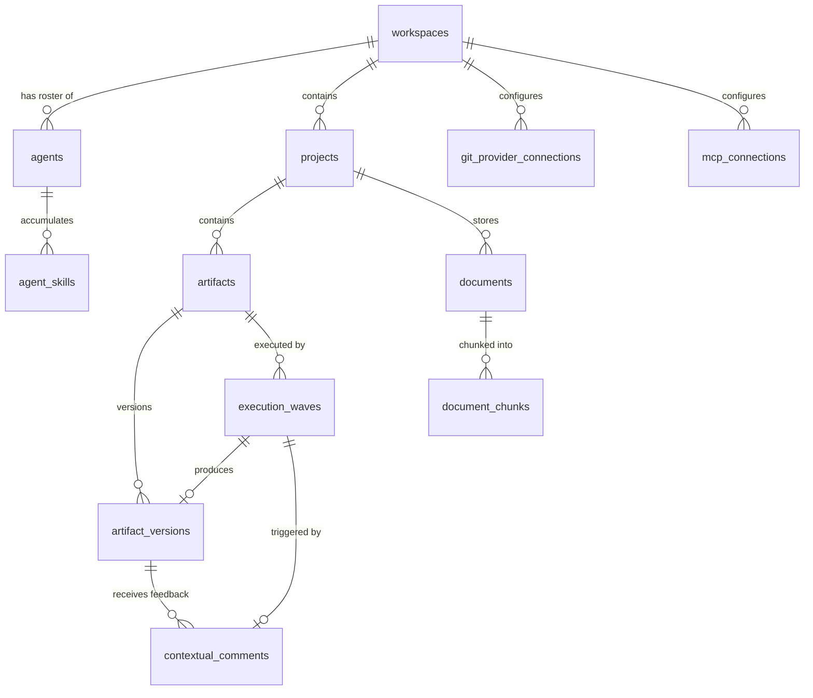

# Phase 2 — Backend Architecture & Data Model (TDD)

> **Document type:** Technical Design Document
> **Status:** Draft
> **Source of truth:** `docs/VISION_2.0.md`, `docs/TDD/01_PRD_AND_WORKFLOWS.md`
> **Scope:** Database schema, storage layers, asynchronous execution engine, and safety mechanisms. No frontend, no prompt engineering, no AI agent logic.

---

## Architectural Decisions Log

These decisions were made during the design phase and govern every section of this document.

| ID | Decision | Rationale |
|---|---|---|
| **AD-1** | Single-tenant MVP, multi-tenant schema | Ship fast. Every core table has a `workspace_id` FK. MVP hardcodes `workspace_id = 1` in the API layer. No User/Auth model yet. |
| **AD-2** | Celery + Redis for durable execution | Already configured in the codebase. Temporal deferred to avoid infrastructure learning curve. |
| **AD-3** | One orchestrator Celery task per execution | Agents auto-assume (no pauses), so a DAG execution is a fast uninterrupted process. Single Python process uses `asyncio.gather` for parallel waves. Reaper cron handles crashes. |
| **AD-4** | Agent skills stored in database (not S3) | Small, frequently updated text. SQL makes compaction and token counting trivial. S3 reserved for artifacts and uploaded documents only. |
| **AD-5** | Multi-file artifacts: S3 directory + JSONB manifest | `file_manifest` JSONB column on `ArtifactVersion` lets the frontend instantly enumerate files without S3 `ListObjects`. Actual files at `artifacts/{artifact_id}/v{version}/{filepath}`. |
| **AD-6** | Diffs computed on-the-fly by the frontend | Backend returns raw text of v1 and v2. `react-diff-viewer-continued` renders the diff in the browser. Code diffs outsourced to GitHub/GitLab PRs. No diff storage. |
| **AD-7** | pgvector for uploaded documents only | Agent skills are injected directly into the prompt (5k-8k token budget). Only large external files (PDFs, docs) that cannot fit in the context window need embedding + RAG. |

---

## 1. Database Schema (PostgreSQL 16 + pgvector)

### 1.1 Entity-Relationship Overview

```
workspaces
 ├── agents ──────────────── agent_skills
 ├── projects
 │    ├── artifacts
 │    │    ├── artifact_versions ─── contextual_comments
 │    │    └── execution_waves
 │    └── documents ──────── document_chunks (pgvector)
 ├── git_provider_connections
 └── mcp_connections
```

All tables use **UUID v4** primary keys (`TEXT` column, generated in Python via `uuid.uuid4()`). All timestamps are **UTC** with timezone (`TIMESTAMP WITH TIME ZONE`).

---

### 1.2 Table Definitions

#### `workspaces`

The top-level tenant container. MVP: one row with a hardcoded ID.

| Column | Type | Constraints | Description |
|---|---|---|---|
| `id` | `TEXT` | PK | UUID v4 |
| `name` | `VARCHAR(255)` | NOT NULL | Account/company name |
| `domain_description` | `TEXT` | | Company description from onboarding (industry, product, goals) |
| `tech_stack` | `TEXT` | | Tech stack from onboarding (e.g., "Next.js, FastAPI, PostgreSQL") |
| `monthly_budget_usd` | `NUMERIC(10,2)` | DEFAULT 50.00 | Account-level monthly spending ceiling |
| `monthly_spend_usd` | `NUMERIC(10,2)` | DEFAULT 0.00 | Running total for the current billing period |
| `billing_period_start` | `TIMESTAMPTZ` | | Start of current billing period (resets monthly) |
| `onboarding_completed` | `BOOLEAN` | DEFAULT FALSE | Whether the onboarding flow has been completed |
| `created_at` | `TIMESTAMPTZ` | NOT NULL, DEFAULT NOW() | |
| `updated_at` | `TIMESTAMPTZ` | NOT NULL, DEFAULT NOW() | |

**Indexes:** None beyond PK (single row in MVP).

---

#### `agents`

Persistent AI entities that live in the workspace roster.

| Column | Type | Constraints | Description |
|---|---|---|---|
| `id` | `TEXT` | PK | UUID v4 |
| `workspace_id` | `TEXT` | FK → `workspaces.id`, NOT NULL | Tenant isolation |
| `name` | `VARCHAR(255)` | NOT NULL | Display name (e.g., "Content Writer") |
| `specialization` | `VARCHAR(500)` | NOT NULL | Role description (e.g., "Technical documentation specialist") |
| `description` | `TEXT` | | Longer description of the agent's focus and capabilities |
| `system_prompt` | `TEXT` | | The base system instructions for this agent's specialization |
| `status` | `VARCHAR(20)` | NOT NULL, DEFAULT 'learning' | Enum: `learning`, `ready`, `working`, `reflecting` |
| `readiness_score` | `INTEGER` | DEFAULT 0, CHECK (0-100) | Knowledge readiness (0 = insufficient, 50+ = partial, 80+ = sufficient) |
| `progression_level` | `VARCHAR(20)` | DEFAULT 'apprenti' | Enum: `apprenti`, `opérationnel`, `expert` |
| `model_tier` | `VARCHAR(10)` | DEFAULT 'sonnet' | Enum: `sonnet`, `opus` |
| `tools` | `JSONB` | DEFAULT '[]' | List of enabled tool identifiers (e.g., `["web_search", "file_read", "git"]`) |
| `completed_artifacts` | `INTEGER` | DEFAULT 0 | Lifetime count of approved artifacts this agent contributed to |
| `avg_quality_score` | `NUMERIC(3,1)` | | Rolling average quality score (1.0-5.0, nullable until first review) |
| `last_reflection_at` | `TIMESTAMPTZ` | | Timestamp of last completed reflection cycle |
| `archived_at` | `TIMESTAMPTZ` | | Non-null = soft-archived (excluded from auto-assembly, hidden from active roster) |
| `created_at` | `TIMESTAMPTZ` | NOT NULL, DEFAULT NOW() | |
| `updated_at` | `TIMESTAMPTZ` | NOT NULL, DEFAULT NOW() | |

**Indexes:**
- `ix_agents_workspace_id` on `(workspace_id)`
- `ix_agents_workspace_status` on `(workspace_id, status)` — fast roster queries filtered by status
- `ix_agents_workspace_archived` on `(workspace_id)` WHERE `archived_at IS NULL` — partial index for active agents only

**Readiness thresholds (application-level constants, not DB constraints):**
- `0-49` → `insufficient` — agent cannot be auto-assembled
- `50-79` → `partial` — agent can be auto-assembled (minimum gate)
- `80-100` → `sufficient` — fully prepared

**Progression rules (application-level):**
- `apprenti` → `opérationnel`: `completed_artifacts >= 5`
- `opérationnel` → `expert`: `completed_artifacts >= 20` AND `avg_quality_score >= 4.0`

---

#### `agent_skills`

Accumulated knowledge stored as text entries. This is the agent's "memory" — skills, work learnings, and briefing context.

| Column | Type | Constraints | Description |
|---|---|---|---|
| `id` | `TEXT` | PK | UUID v4 |
| `agent_id` | `TEXT` | FK → `agents.id` ON DELETE CASCADE, NOT NULL | |
| `category` | `VARCHAR(20)` | NOT NULL | Enum: `skill`, `work_learning`, `briefing` |
| `title` | `VARCHAR(500)` | NOT NULL | Human-readable label (e.g., "Brand voice preferences") |
| `content` | `TEXT` | NOT NULL | The actual markdown content |
| `token_count` | `INTEGER` | NOT NULL | Pre-computed token count (used for budget enforcement) |
| `source_artifact_id` | `TEXT` | FK → `artifacts.id` ON DELETE SET NULL | Which artifact produced this learning (null for briefings and manual research) |
| `created_at` | `TIMESTAMPTZ` | NOT NULL, DEFAULT NOW() | |
| `updated_at` | `TIMESTAMPTZ` | NOT NULL, DEFAULT NOW() | |

**Indexes:**
- `ix_agent_skills_agent_id` on `(agent_id)`
- `ix_agent_skills_agent_category` on `(agent_id, category)` — fast retrieval by type for prompt assembly

**Token budget enforcement (application-level):**

The total `token_count` across all `skill` + `work_learning` rows for a single agent must not exceed **8,000 tokens**. The API layer checks this before inserting/updating. When the budget is approached, the reflection system triggers **compaction** — merging redundant entries, removing obsolete ones, distilling patterns into fewer, denser rows.

```
SELECT SUM(token_count)
FROM agent_skills
WHERE agent_id = :id
  AND category IN ('skill', 'work_learning');
```

`briefing` entries (project context) are counted separately and are not subject to the 8k ceiling — they are replaced on each rebriefing, not accumulated.

---

#### `projects`

Container for related work. Holds the published project brief.

| Column | Type | Constraints | Description |
|---|---|---|---|
| `id` | `TEXT` | PK | UUID v4 |
| `workspace_id` | `TEXT` | FK → `workspaces.id`, NOT NULL | Tenant isolation |
| `name` | `VARCHAR(255)` | NOT NULL | |
| `description` | `TEXT` | | |
| `brief_draft` | `TEXT` | | Working draft of the project brief (auto-saved) |
| `brief_published` | `TEXT` | | The currently published brief. Agents are briefed on this. |
| `brief_fingerprint` | `VARCHAR(64)` | | SHA-256 hash of `brief_published`. Used for change detection → rebriefing. |
| `brief_published_at` | `TIMESTAMPTZ` | | When the brief was last published |
| `created_at` | `TIMESTAMPTZ` | NOT NULL, DEFAULT NOW() | |
| `updated_at` | `TIMESTAMPTZ` | NOT NULL, DEFAULT NOW() | |

**Indexes:**
- `ix_projects_workspace_id` on `(workspace_id)`

---

#### `artifacts`

The core entity — a deliverable.

| Column | Type | Constraints | Description |
|---|---|---|---|
| `id` | `TEXT` | PK | UUID v4 |
| `project_id` | `TEXT` | FK → `projects.id` ON DELETE CASCADE, NOT NULL | |
| `artifact_type` | `VARCHAR(10)` | NOT NULL | Enum: `prose`, `code` |
| `title` | `VARCHAR(500)` | NOT NULL | Short name for the deliverable |
| `goal` | `TEXT` | | What success looks like |
| `target_audience` | `TEXT` | | Who will consume this artifact |
| `context` | `TEXT` | | Background info, links, constraints |
| `description` | `TEXT` | | Detailed instructions (the "body" of the brief) |
| `status` | `VARCHAR(15)` | NOT NULL, DEFAULT 'drafting' | Enum: `drafting`, `in_review`, `approved`, `cancelled` |
| `max_budget_usd` | `NUMERIC(10,2)` | DEFAULT 5.00 | Per-artifact cost ceiling (circuit breaker) |
| `total_cost_usd` | `NUMERIC(10,2)` | DEFAULT 0.00 | Accumulated cost across all execution waves |
| `current_version` | `INTEGER` | DEFAULT 0 | Latest version number (0 = no versions yet) |
| `git_repo_url` | `VARCHAR(1024)` | | For code artifacts: target repository URL |
| `git_base_branch` | `VARCHAR(255)` | | For code artifacts: base branch (e.g., "main") |
| `git_feature_branch` | `VARCHAR(255)` | | For code artifacts: created feature branch |
| `git_pr_url` | `VARCHAR(1024)` | | For code artifacts: URL of the opened PR |
| `git_pr_number` | `INTEGER` | | For code artifacts: PR number (for webhook matching) |
| `cancelled_at` | `TIMESTAMPTZ` | | When the artifact was cancelled (soft cancel = archived) |
| `approved_at` | `TIMESTAMPTZ` | | When the artifact was approved |
| `created_at` | `TIMESTAMPTZ` | NOT NULL, DEFAULT NOW() | |
| `updated_at` | `TIMESTAMPTZ` | NOT NULL, DEFAULT NOW() | |

**Indexes:**
- `ix_artifacts_project_id` on `(project_id)`
- `ix_artifacts_project_status` on `(project_id, status)` — fast filtered listing
- `ix_artifacts_git_pr` on `(git_pr_url)` WHERE `git_pr_url IS NOT NULL` — webhook PR matching

---

#### `artifact_versions`

Immutable snapshots. Never updated after creation.

| Column | Type | Constraints | Description |
|---|---|---|---|
| `id` | `TEXT` | PK | UUID v4 |
| `artifact_id` | `TEXT` | FK → `artifacts.id` ON DELETE CASCADE, NOT NULL | |
| `version_number` | `INTEGER` | NOT NULL | Sequential: 1, 2, 3... |
| `s3_prefix` | `VARCHAR(1024)` | NOT NULL | S3 directory prefix (e.g., `artifacts/{artifact_id}/v1/`) |
| `file_manifest` | `JSONB` | NOT NULL, DEFAULT '[]' | Ordered list of relative file paths (e.g., `["src/index.ts", "src/styles.css"]`) |
| `token_cost_usd` | `NUMERIC(10,4)` | DEFAULT 0 | Cost of the execution that produced this version |
| `input_tokens` | `INTEGER` | DEFAULT 0 | Total input tokens consumed |
| `output_tokens` | `INTEGER` | DEFAULT 0 | Total output tokens consumed |
| `assumptions` | `JSONB` | DEFAULT '[]' | List of assumptions agents made (e.g., `[{"text": "US market only", "agent": "Research Analyst"}]`) |
| `sources` | `JSONB` | DEFAULT '[]' | List of sources agents used (e.g., `[{"url": "...", "title": "...", "agent": "Research Analyst"}]`) |
| `execution_wave_id` | `TEXT` | FK → `execution_waves.id` ON DELETE SET NULL | Which wave produced this version |
| `created_at` | `TIMESTAMPTZ` | NOT NULL, DEFAULT NOW() | |

**Indexes:**
- `ix_artifact_versions_artifact_id` on `(artifact_id)`
- `uq_artifact_versions_artifact_version` UNIQUE on `(artifact_id, version_number)` — enforce sequential integrity

**Immutability rule:** No `UPDATE` operations on this table. Application layer enforces this. Each iteration creates a new row with `version_number = previous + 1`.

---

#### `contextual_comments`

User feedback tied to a specific location in a specific version. Triggers the next iteration.

| Column | Type | Constraints | Description |
|---|---|---|---|
| `id` | `TEXT` | PK | UUID v4 |
| `artifact_version_id` | `TEXT` | FK → `artifact_versions.id` ON DELETE CASCADE, NOT NULL | Which version this comment targets |
| `file_path` | `VARCHAR(1024)` | | Which file in the bundle (null = applies to the whole artifact or single-file prose) |
| `highlight_start` | `INTEGER` | | Character offset start of highlighted text |
| `highlight_end` | `INTEGER` | | Character offset end of highlighted text |
| `highlighted_text` | `TEXT` | | The verbatim highlighted text (snapshot — in case the file changes) |
| `instruction` | `TEXT` | NOT NULL | The user's feedback/change request |
| `source` | `VARCHAR(20)` | DEFAULT 'in_app' | Enum: `in_app`, `github_pr`, `gitlab_mr` — where this feedback originated |
| `external_comment_id` | `VARCHAR(255)` | | GitHub/GitLab comment ID (for deduplication of webhook events) |
| `resolved` | `BOOLEAN` | DEFAULT FALSE | Whether this comment was addressed in a subsequent version |
| `resolved_in_version_id` | `TEXT` | FK → `artifact_versions.id` ON DELETE SET NULL | Which version resolved this comment |
| `created_at` | `TIMESTAMPTZ` | NOT NULL, DEFAULT NOW() | |

**Indexes:**
- `ix_contextual_comments_version_id` on `(artifact_version_id)`
- `uq_contextual_comments_external` UNIQUE on `(source, external_comment_id)` WHERE `external_comment_id IS NOT NULL` — prevent duplicate webhook processing

---

#### `execution_waves`

Tracks each DAG execution run. One execution wave = one orchestrator Celery task = one ArtifactVersion produced.

| Column | Type | Constraints | Description |
|---|---|---|---|
| `id` | `TEXT` | PK | UUID v4 |
| `artifact_id` | `TEXT` | FK → `artifacts.id` ON DELETE CASCADE, NOT NULL | |
| `celery_task_id` | `VARCHAR(255)` | | Celery `AsyncResult.id` for tracking/revocation |
| `trigger` | `VARCHAR(20)` | NOT NULL | Enum: `initial`, `iteration`, `retry` — what caused this wave |
| `trigger_comment_id` | `TEXT` | FK → `contextual_comments.id` ON DELETE SET NULL | If `trigger = iteration`, which comment triggered it |
| `dag_plan` | `JSONB` | NOT NULL | The wave structure (see Section 3 for schema) |
| `assembled_team` | `JSONB` | NOT NULL | List of agent IDs auto-selected from the roster |
| `status` | `VARCHAR(15)` | NOT NULL, DEFAULT 'queued' | Enum: `queued`, `running`, `completed`, `failed`, `cancelled` |
| `current_step` | `INTEGER` | DEFAULT 0 | Which DAG wave is currently executing (for heartbeat UI) |
| `total_steps` | `INTEGER` | DEFAULT 0 | Total number of DAG waves (for heartbeat UI) |
| `step_labels` | `JSONB` | DEFAULT '[]' | Human-readable labels for each step (e.g., `["Researching...", "Drafting...", "QA Review"]`) |
| `cost_usd` | `NUMERIC(10,4)` | DEFAULT 0 | Cost of this specific wave |
| `input_tokens` | `INTEGER` | DEFAULT 0 | |
| `output_tokens` | `INTEGER` | DEFAULT 0 | |
| `error_message` | `TEXT` | | If `status = failed`, the error reason |
| `started_at` | `TIMESTAMPTZ` | | When execution began |
| `completed_at` | `TIMESTAMPTZ` | | When execution finished (success or failure) |
| `created_at` | `TIMESTAMPTZ` | NOT NULL, DEFAULT NOW() | |

**Indexes:**
- `ix_execution_waves_artifact_id` on `(artifact_id)`
- `ix_execution_waves_status` on `(status)` WHERE `status IN ('queued', 'running')` — partial index for the reaper to find active/stuck waves

---

#### `documents`

User-uploaded files for project context.

| Column | Type | Constraints | Description |
|---|---|---|---|
| `id` | `TEXT` | PK | UUID v4 |
| `project_id` | `TEXT` | FK → `projects.id` ON DELETE CASCADE, NOT NULL | |
| `filename` | `VARCHAR(500)` | NOT NULL | Original filename |
| `mime_type` | `VARCHAR(100)` | NOT NULL | e.g., `application/pdf`, `text/markdown` |
| `s3_path` | `VARCHAR(1024)` | NOT NULL | Path in S3 bucket |
| `size_bytes` | `BIGINT` | NOT NULL | File size |
| `chunk_count` | `INTEGER` | DEFAULT 0 | Number of embedding chunks created |
| `processing_status` | `VARCHAR(15)` | DEFAULT 'pending' | Enum: `pending`, `processing`, `ready`, `failed` |
| `created_at` | `TIMESTAMPTZ` | NOT NULL, DEFAULT NOW() | |

**Indexes:**
- `ix_documents_project_id` on `(project_id)`

---

#### `document_chunks`

Chunked + embedded document content for semantic search (pgvector).

| Column | Type | Constraints | Description |
|---|---|---|---|
| `id` | `TEXT` | PK | UUID v4 |
| `document_id` | `TEXT` | FK → `documents.id` ON DELETE CASCADE, NOT NULL | |
| `chunk_index` | `INTEGER` | NOT NULL | Sequential position within the document |
| `content` | `TEXT` | NOT NULL | The raw text of this chunk |
| `token_count` | `INTEGER` | NOT NULL | Token count of the chunk content |
| `embedding` | `vector(1024)` | NOT NULL | Embedding vector (see Section 2 for model choice) |
| `created_at` | `TIMESTAMPTZ` | NOT NULL, DEFAULT NOW() | |

**Indexes:**
- `ix_document_chunks_document_id` on `(document_id)`
- `ix_document_chunks_embedding` — IVFFlat or HNSW index on `embedding` column for fast similarity search (see Section 2)

---

#### `git_provider_connections`

GitHub/GitLab OAuth connections.

| Column | Type | Constraints | Description |
|---|---|---|---|
| `id` | `TEXT` | PK | UUID v4 |
| `workspace_id` | `TEXT` | FK → `workspaces.id`, NOT NULL | |
| `provider` | `VARCHAR(10)` | NOT NULL | Enum: `github`, `gitlab` |
| `display_name` | `VARCHAR(255)` | NOT NULL | User-chosen label (e.g., "My GitHub") |
| `access_token_encrypted` | `TEXT` | NOT NULL | Encrypted PAT or OAuth token |
| `repositories` | `JSONB` | DEFAULT '[]' | List of allowed repos (e.g., `[{"owner": "acme", "name": "webapp", "default_branch": "main"}]`) |
| `webhook_secret` | `VARCHAR(255)` | | Shared secret for verifying webhook payloads |
| `status` | `VARCHAR(10)` | DEFAULT 'active' | Enum: `active`, `error`, `revoked` |
| `last_verified_at` | `TIMESTAMPTZ` | | Last successful connection test |
| `created_at` | `TIMESTAMPTZ` | NOT NULL, DEFAULT NOW() | |
| `updated_at` | `TIMESTAMPTZ` | NOT NULL, DEFAULT NOW() | |

**Indexes:**
- `ix_git_connections_workspace_id` on `(workspace_id)`

---

#### `mcp_connections`

Model Context Protocol server connections.

| Column | Type | Constraints | Description |
|---|---|---|---|
| `id` | `TEXT` | PK | UUID v4 |
| `workspace_id` | `TEXT` | FK → `workspaces.id`, NOT NULL | |
| `name` | `VARCHAR(255)` | NOT NULL | User-chosen label (e.g., "Notion", "Slack") |
| `server_url` | `VARCHAR(1024)` | NOT NULL | MCP server endpoint |
| `auth_type` | `VARCHAR(20)` | DEFAULT 'api_key' | Enum: `api_key`, `oauth`, `none` |
| `auth_config_encrypted` | `JSONB` | | Encrypted auth credentials |
| `discovered_tools` | `JSONB` | DEFAULT '[]' | List of tool descriptors from the server |
| `status` | `VARCHAR(15)` | DEFAULT 'active' | Enum: `active`, `error`, `unavailable` |
| `last_verified_at` | `TIMESTAMPTZ` | | |
| `created_at` | `TIMESTAMPTZ` | NOT NULL, DEFAULT NOW() | |
| `updated_at` | `TIMESTAMPTZ` | NOT NULL, DEFAULT NOW() | |

**Indexes:**
- `ix_mcp_connections_workspace_id` on `(workspace_id)`

---

### 1.3 Full ER Diagram (Mermaid)



---

## 2. Vector Storage (pgvector)

### 2.1 What Gets Embedded

**Only uploaded project documents.** Agent skills and work learnings are injected directly into the LLM prompt (within the 5k-8k token identity budget) and do not need semantic search.

### 2.2 Embedding Model

| Setting | Value | Rationale |
|---|---|---|
| **Model** | `voyage-3-lite` (or Anthropic's embedding endpoint when available) | Good quality/cost ratio for document retrieval |
| **Dimensions** | 1024 | Sufficient for document-level similarity |
| **Max chunk size** | 512 tokens | Balances retrieval granularity with context coherence |
| **Chunk overlap** | 50 tokens | Prevents losing context at chunk boundaries |

The embedding model is a configurable setting — if Anthropic ships a native embedding model, we swap it without schema changes (the `vector(1024)` column stays fixed; we pad or truncate if dimensions differ, or run a migration).

### 2.3 Chunking Strategy

1. **Receive uploaded file** → extract raw text (PDF via `pymupdf`/`pdfplumber`, DOCX via `python-docx`, plain text as-is).
2. **Split into chunks** using a recursive text splitter (LangChain's `RecursiveCharacterTextSplitter` or equivalent): split on `\n\n`, then `\n`, then sentence boundary, then word boundary. Target: 512 tokens per chunk, 50 token overlap.
3. **Compute embeddings** for each chunk via the embedding API.
4. **Insert** `document_chunks` rows with the embedding vector.
5. **Update** `documents.chunk_count` and `documents.processing_status = 'ready'`.

This runs as a **Celery task** (`process_document_upload`) triggered on file upload.

### 2.4 Retrieval Query

During agent execution, when an agent needs project context from uploaded documents:

```sql
SELECT dc.content, dc.chunk_index, d.filename
FROM document_chunks dc
JOIN documents d ON d.id = dc.document_id
WHERE d.project_id = :project_id
  AND d.processing_status = 'ready'
ORDER BY dc.embedding <=> :query_embedding
LIMIT :top_k;
```

`<=>` is pgvector's cosine distance operator. Default `top_k = 10`.

### 2.5 Index Strategy

Use **HNSW** index for fast approximate nearest neighbor search:

```sql
CREATE INDEX ix_document_chunks_embedding
ON document_chunks
USING hnsw (embedding vector_cosine_ops)
WITH (m = 16, ef_construction = 64);
```

HNSW is preferred over IVFFlat because:
- No need to re-train the index as data grows
- Better recall at low latency
- The document corpus per project is small enough (hundreds to low thousands of chunks) that HNSW overhead is negligible

---

## 3. Durable Execution Engine (Celery + Redis)

### 3.1 Architecture Overview

```
┌──────────────┐     ┌──────────────┐     ┌──────────────────────────┐
│  FastAPI      │     │  Redis       │     │  Celery Worker           │
│  (API Layer)  │────▶│  (Broker)    │────▶│                          │
│               │     │              │     │  execute_artifact_dag()  │
│  POST         │     │              │     │  ├── Wave 1: asyncio     │
│  /artifacts   │     │              │     │  │   gather(agent_a,     │
│  /iterate     │     │              │     │  │          agent_b)     │
│               │     │              │     │  ├── Wave 2: agent_c     │
│               │     │              │     │  ├── Wave 3: agent_d     │
│               │     │              │     │  └── Upload to S3        │
└──────────────┘     └──────────────┘     └──────────────────────────┘
                                                       │
                                                       ▼
                                          ┌──────────────────────────┐
                                          │  PostgreSQL              │
                                          │  (execution_waves,       │
                                          │   artifact_versions)     │
                                          └──────────────────────────┘
```

### 3.2 Celery Task Definitions

#### Primary task: `execute_artifact_dag`

The single orchestrator task. One instance = one complete DAG execution producing one ArtifactVersion.

```
Task: execute_artifact_dag(execution_wave_id: str)

Lifecycle:
1. Load ExecutionWave from DB (includes dag_plan, assembled_team)
2. Set status = 'running', started_at = now()
3. For each wave in dag_plan.waves (sequentially):
   a. Update current_step (for heartbeat UI)
   b. Load agents assigned to this wave
   c. For each agent: build prompt (system + skills + upstream outputs + brief)
   d. Run all agents in the wave concurrently via asyncio.gather()
   e. Collect outputs, accumulate token counts
   f. Check cost against artifact.max_budget_usd → abort if exceeded
   g. Store wave outputs in memory (passed as context to downstream waves)
4. Compile final output (merge all agent contributions into files)
5. Upload files to S3 at artifacts/{artifact_id}/v{version}/{filepath}
6. Create ArtifactVersion row (file_manifest, token costs, assumptions, sources)
7. Update Artifact.status = 'in_review', Artifact.current_version += 1
8. For code artifacts: push to feature branch, open/update PR
9. Update ExecutionWave.status = 'completed', completed_at = now()
10. Update Workspace.monthly_spend_usd (atomic increment)

Error handling:
- LLM API error → retry the specific agent call up to 3 times (exponential backoff: 5s, 15s, 45s)
- All retries exhausted → ExecutionWave.status = 'failed', ExecutionWave.error_message = reason
- Artifact.status remains 'drafting' with the error surfaced to the user
- Cost ceiling hit → ExecutionWave.status = 'failed', error = 'budget_exceeded'

Celery config:
- acks_late = True (re-queued if worker crashes before completion)
- max_retries = 0 (retries are handled internally, not by Celery)
- soft_time_limit = 600 (10 minutes — kill if stuck)
- time_limit = 660 (hard kill 1 minute after soft limit)
```

#### Secondary task: `process_document_upload`

Handles document ingestion and embedding.

```
Task: process_document_upload(document_id: str)

Lifecycle:
1. Load Document from DB
2. Download file from S3
3. Extract raw text (PDF/DOCX/TXT/MD/CSV/JSON/YAML)
4. Chunk text (512 tokens, 50 token overlap)
5. Compute embeddings (batch API call)
6. Insert document_chunks rows
7. Update Document.chunk_count, Document.processing_status = 'ready'

Error handling:
- Unsupported format → Document.processing_status = 'failed'
- Embedding API error → retry up to 3 times
- All retries exhausted → Document.processing_status = 'failed'

Celery config:
- max_retries = 3, retry_backoff = True
- soft_time_limit = 120
```

#### Periodic task: `reap_orphaned_waves`

The "Reaper" — detects stuck executions and recovers them.

```
Task: reap_orphaned_waves (runs every 2 minutes via Celery Beat)

Logic:
1. SELECT * FROM execution_waves
   WHERE status = 'running'
   AND started_at < NOW() - INTERVAL '10 minutes'
2. For each orphaned wave:
   a. Check if the Celery task is still alive (inspect active tasks)
   b. If dead: set status = 'failed', error_message = 'Worker crashed — execution orphaned'
   c. If alive but past soft_time_limit: revoke the Celery task
3. Notify user (artifact remains in 'drafting' with error banner)
```

### 3.3 DAG Plan Schema (JSONB)

The `dag_plan` column on `execution_waves` stores the wave structure:

```json
{
  "waves": [
    {
      "wave_number": 1,
      "label": "Researching competitors",
      "agents": [
        {
          "agent_id": "uuid-research-analyst",
          "role_in_wave": "Research competitor pricing, features, reviews",
          "output_key": "research_data"
        },
        {
          "agent_id": "uuid-product-expert",
          "role_in_wave": "Define analysis framework and key dimensions",
          "output_key": "analysis_framework"
        }
      ]
    },
    {
      "wave_number": 2,
      "label": "Drafting analysis",
      "agents": [
        {
          "agent_id": "uuid-strategy-analyst",
          "role_in_wave": "Write the competitive analysis using research data and framework",
          "output_key": "draft_report",
          "depends_on": ["research_data", "analysis_framework"]
        }
      ]
    },
    {
      "wave_number": 3,
      "label": "QA & compilation",
      "agents": [
        {
          "agent_id": "uuid-qa-engineer",
          "role_in_wave": "Review for clarity, consistency, missing gaps",
          "output_key": "final_report",
          "depends_on": ["draft_report"]
        }
      ]
    }
  ]
}
```

**Context flow:** After each wave completes, the outputs (keyed by `output_key`) are stored in an in-memory dictionary. Downstream agents receive upstream outputs via `depends_on` references — these are injected into their prompt as context.

### 3.4 Heartbeat Updates

During execution, the orchestrator task updates the `execution_waves` row after each wave completes:

```sql
UPDATE execution_waves
SET current_step = :wave_number,
    cost_usd = :running_cost,
    input_tokens = :running_input_tokens,
    output_tokens = :running_output_tokens
WHERE id = :wave_id;
```

The frontend polls `GET /api/artifacts/{id}/status` which reads from this row:

```json
{
  "status": "drafting",
  "execution": {
    "current_step": 2,
    "total_steps": 3,
    "step_labels": ["Researching competitors", "Drafting analysis", "QA & compilation"],
    "cost_usd": 0.42,
    "started_at": "2026-03-26T10:30:00Z"
  }
}
```

Polling interval: **3 seconds** (configurable). No WebSockets needed for MVP — the heartbeat data is tiny and changes infrequently (once per wave, typically every 30-120 seconds).

---

## 4. Object Storage (S3 / MinIO)

### 4.1 Bucket Structure

One bucket: `agent-artifacts` (already configured in docker-compose).

```
agent-artifacts/
├── artifacts/
│   └── {artifact_id}/
│       └── v{version_number}/
│           ├── report.md                          ← prose: single file
│           ├── src/
│           │   ├── components/
│           │   │   └── SettingsPage.tsx            ← code: multi-file
│           │   └── api/
│           │       └── settings.ts
│           └── tests/
│               └── settings.test.ts
│
└── documents/
    └── {document_id}/
        └── {original_filename}                    ← uploaded file (PDF, DOCX, etc.)
```

### 4.2 Path Convention

| Content | S3 Key Pattern | Example |
|---|---|---|
| Artifact file | `artifacts/{artifact_id}/v{version}/{relative_path}` | `artifacts/abc-123/v1/src/index.ts` |
| Uploaded document | `documents/{document_id}/{filename}` | `documents/def-456/competitor-report.pdf` |

The `s3_prefix` column on `artifact_versions` stores `artifacts/{artifact_id}/v{version}/`. The `file_manifest` JSONB column stores the list of relative paths within that prefix.

**Example `artifact_versions` row:**
```json
{
  "s3_prefix": "artifacts/abc-123/v1/",
  "file_manifest": [
    "src/components/SettingsPage.tsx",
    "src/api/settings.ts",
    "tests/settings.test.ts"
  ]
}
```

To reconstruct a full S3 key: `s3_prefix + file_manifest[i]`.

### 4.3 Lifecycle & Cleanup

| Rule | Policy |
|---|---|
| **Approved artifacts** | Retained indefinitely. |
| **Cancelled artifacts** | Retained for 30 days after cancellation, then purged (S3 lifecycle rule on prefix). |
| **Hard-deleted artifacts** | S3 objects deleted immediately when the user hard-deletes. |
| **Uploaded documents** | Retained as long as the project exists. Deleted when the document is deleted or the project is hard-deleted. |
| **Orphaned S3 objects** | Weekly background job compares S3 prefixes against `artifact_versions.s3_prefix` and `documents.s3_path`. Deletes objects with no matching DB row. |

### 4.4 File Size Limits

| Content | Max Size | Enforced By |
|---|---|---|
| Single artifact file | 1 MB | Application layer (agents should not produce files larger than this) |
| Total artifact version bundle | 10 MB | Application layer |
| Uploaded document | 20 MB | API layer (`Content-Length` check) |

---

## 5. Circuit Breakers & Cost Safety

### 5.1 Three-Tier Cost Enforcement

```
┌──────────────────────────────────────────────────┐
│ Tier 1: Per-Wave                                  │
│ ┌──────────────────────────────────────────────┐ │
│ │ After each LLM call within a wave:           │ │
│ │   running_cost += call_cost                  │ │
│ │   if running_cost > artifact.max_budget_usd: │ │
│ │     ABORT wave → status = 'failed'           │ │
│ │     error = 'budget_exceeded'                │ │
│ └──────────────────────────────────────────────┘ │
│                                                    │
│ Tier 2: Per-Artifact                              │
│ ┌──────────────────────────────────────────────┐ │
│ │ artifact.total_cost_usd accumulates across   │ │
│ │ all execution waves (initial + iterations).  │ │
│ │ If total_cost_usd > max_budget_usd:          │ │
│ │   Block new iterations.                      │ │
│ │   User must increase budget to continue.     │ │
│ └──────────────────────────────────────────────┘ │
│                                                    │
│ Tier 3: Per-Account (Monthly)                     │
│ ┌──────────────────────────────────────────────┐ │
│ │ workspace.monthly_spend_usd accumulates.     │ │
│ │ If monthly_spend_usd > monthly_budget_usd:   │ │
│ │   Block ALL new executions account-wide.     │ │
│ │   Existing in-review artifacts unaffected.   │ │
│ └──────────────────────────────────────────────┘ │
└──────────────────────────────────────────────────┘
```

### 5.2 Token-to-Cost Calculation

Cost is computed per LLM call using the model's pricing:

```python
def compute_call_cost(input_tokens: int, output_tokens: int, model: str) -> Decimal:
    """Pricing table (updated as Anthropic changes rates)."""
    PRICING = {
        "sonnet": {"input": Decimal("0.003"), "output": Decimal("0.015")},   # per 1K tokens
        "opus":   {"input": Decimal("0.015"), "output": Decimal("0.075")},
        "haiku":  {"input": Decimal("0.0008"), "output": Decimal("0.004")},
    }
    rate = PRICING[model]
    return (input_tokens * rate["input"] + output_tokens * rate["output"]) / 1000
```

The pricing table is a Python constant (not in the DB). Updated manually when Anthropic changes rates. Tracked on `execution_waves` and rolled up to `artifact_versions` and `artifacts`.

### 5.3 Cost Check Flow During Execution

```
For each agent LLM call within execute_artifact_dag:
  1. Make the API call → get response with usage (input_tokens, output_tokens)
  2. cost = compute_call_cost(usage.input_tokens, usage.output_tokens, agent.model_tier)
  3. wave_running_cost += cost
  4. Check: wave_running_cost > artifact.max_budget_usd?
     YES → abort execution, set wave.status = 'failed', error = 'budget_exceeded'
     NO  → continue
  5. Check: artifact.total_cost_usd + wave_running_cost > artifact.max_budget_usd?
     YES → abort (same as above)
     NO  → continue
  6. At wave completion:
     UPDATE artifacts SET total_cost_usd = total_cost_usd + :wave_cost
     UPDATE workspaces SET monthly_spend_usd = monthly_spend_usd + :wave_cost
```

### 5.4 Monthly Budget Reset

A Celery Beat periodic task (`reset_monthly_budgets`) runs daily at 00:00 UTC:

```sql
UPDATE workspaces
SET monthly_spend_usd = 0.00,
    billing_period_start = NOW()
WHERE billing_period_start < NOW() - INTERVAL '30 days';
```

---

## 6. Reflection & Agent Locking

### 6.1 When Reflection Triggers

Reflection is triggered after an artifact is approved, if:
- The agent has completed N artifacts since its last reflection (configurable, default N=3), OR
- It has been more than 7 days since the last reflection.

This is checked in application code after the approval transition, not via a cron job.

### 6.2 Sequential Locking

Reflection writes to the agent's persistent state (`agent_skills` table). To prevent race conditions when two artifacts finish simultaneously for the same agent:

```sql
-- Acquire advisory lock on the agent row
SELECT * FROM agents WHERE id = :agent_id FOR UPDATE;

-- Run reflection logic (extract learnings, update/compact skills)
-- ...

-- Release lock (implicit at transaction commit)
```

`FOR UPDATE` acquires a row-level lock. A second transaction attempting to reflect on the same agent will block until the first commits. Different agents reflect concurrently without contention.

### 6.3 Reflection is Non-Blocking for Execution

If an agent is in `reflecting` status when auto-assembly occurs:
- The agent's **current skills** (pre-reflection) are read for prompt assembly.
- The agent is included in the team — reflection does not block execution.
- If the reflection completes during execution, the updated skills will be available for the *next* execution, not the current one.

This is safe because reflection only writes to `agent_skills` and reads are snapshot-isolated within the execution transaction.

---

## 7. GitHub/GitLab Integration

### 7.1 Push Flow (Code Artifacts)

After `execute_artifact_dag` completes for a code artifact:

```
1. Load git_provider_connections for the workspace
2. Determine target repo from artifact.git_repo_url
3. Clone/checkout the base branch (sparse checkout — only files being modified)
4. Create feature branch: artifact/{artifact_id_short}
5. Write artifact files to the working tree
6. Commit with message: "[AI Agent Team] {artifact.title}"
7. Push feature branch
8. Create PR via GitHub/GitLab API:
   - Title: artifact.title
   - Body: brief summary + assumptions + sources + link back to the app
   - Base: artifact.git_base_branch
9. Store PR URL and PR number on the artifact row
```

### 7.2 Webhook Listener

**Endpoint:** `POST /api/webhooks/github` and `POST /api/webhooks/gitlab`

**Events handled:**

| Event | Action |
|---|---|
| `pull_request_review_comment` (GitHub) / `note` on MR (GitLab) | Create a `contextual_comment` with `source = 'github_pr'` / `'gitlab_mr'`. Trigger a new `execution_wave` with `trigger = 'iteration'`. |
| `pull_request` with `action = 'closed'` and `merged = true` | Transition artifact to `approved`. |
| `pull_request_review` with `state = 'changes_requested'` | If the review body is non-empty, create a `contextual_comment` and trigger iteration. |

**Security:**
- Verify webhook signature using `webhook_secret` from `git_provider_connections`.
- Match PR number against `artifacts.git_pr_number` — ignore events for unknown PRs.
- Deduplicate via `contextual_comments.external_comment_id` (unique constraint prevents double-processing).

### 7.3 Iteration from PR Comments

When a webhook creates a `contextual_comment` with `source = 'github_pr'`:

1. The comment's `instruction` is the PR comment body.
2. The comment's `file_path` is extracted from the GitHub `path` field (for inline comments).
3. The comment's `highlight_start/end` maps to the diff hunk position.
4. A new `execution_wave` is created with `trigger = 'iteration'` and `trigger_comment_id` pointing to this comment.
5. The orchestrator task runs a focused iteration (only the relevant agent, targeting the specific file/section).
6. On completion: push a new commit to the same branch. The PR updates automatically.

---

## 8. Migration Plan

### 8.1 Migration Order

Alembic migrations should be created in this sequence to respect FK dependencies:

```
Migration 1: workspaces
Migration 2: agents, projects
Migration 3: agent_skills, documents, git_provider_connections, mcp_connections
Migration 4: artifacts
Migration 5: execution_waves
Migration 6: artifact_versions
Migration 7: contextual_comments, document_chunks
Migration 8: Seed default workspace (id = hardcoded MVP workspace)
```

### 8.2 Existing Schema Reconciliation

The current codebase has a migration (`6e9eb18a2dd4`) that created `projects`, `artifacts`, `artifact_versions`, and `contextual_comments`. The new migrations should:

1. **Drop and recreate** these tables with the expanded schema defined in this document (the existing tables have fewer columns and no `workspace_id`).
2. Since this is pre-production (no user data to preserve), a clean slate migration is appropriate.

### 8.3 pgvector Extension

The first migration must enable the pgvector extension:

```sql
CREATE EXTENSION IF NOT EXISTS vector;
```

This is already available in the Docker image (`pgvector/pgvector:pg16`).

---

## 9. Docker Infrastructure

### 9.1 Services (docker-compose)

| Service | Image | Port | Purpose |
|---|---|---|---|
| **postgres** | `pgvector/pgvector:pg16` | 5432 | Primary database + vector storage |
| **redis** | `redis:7-alpine` | 6379 | Celery broker + result backend |
| **minio** | `minio/minio` | 9000, 9001 | S3-compatible object storage |
| **backend** | Custom (FastAPI) | 8000 | API server |
| **worker** | Same image as backend | — | Celery worker (runs `execute_artifact_dag`, `process_document_upload`) |
| **beat** | Same image as backend | — | Celery Beat scheduler (runs `reap_orphaned_waves`, `reset_monthly_budgets`) |

### 9.2 Worker Scaling

For MVP, a single Celery worker with concurrency of 1 (`--concurrency=1`) is sufficient. The orchestrator task uses `asyncio.gather` internally for parallelism within a wave, so it's CPU-light and I/O-bound (waiting on LLM API calls).

**Future scaling:** Increase `--concurrency` or add worker replicas. Each execution wave is independent and self-contained — no shared mutable state between tasks.

### 9.3 Redis Configuration

| Setting | Value | Rationale |
|---|---|---|
| `maxmemory` | 256 MB | Sufficient for task queue + results |
| `maxmemory-policy` | `allkeys-lru` | Evict old results, preserve queue |
| Result backend TTL | 3600s (1 hour) | Celery results expire after 1 hour — long-term tracking is in PostgreSQL |

---

## 10. Verification Checklist

Before implementation begins, verify the following against this TDD:

- [ ] All 12 tables can be created via Alembic migrations without FK conflicts (follow Section 8.1 order)
- [ ] The `execute_artifact_dag` Celery task can be invoked with a valid `execution_wave_id` and produces an `ArtifactVersion` row + S3 files
- [ ] The heartbeat polling endpoint (`GET /api/artifacts/{id}/status`) returns `current_step`, `total_steps`, `step_labels`, and `cost_usd` from the `execution_waves` row
- [ ] `process_document_upload` chunks a PDF, computes embeddings, and inserts `document_chunks` with valid pgvector embeddings
- [ ] Semantic search query returns relevant chunks sorted by cosine similarity
- [ ] Cost circuit breaker aborts execution when `max_budget_usd` is exceeded
- [ ] Reaper cron detects a wave stuck in `running` for > 10 minutes and marks it `failed`
- [ ] Reflection acquires `FOR UPDATE` lock and a second concurrent reflection on the same agent blocks (does not corrupt)
- [ ] GitHub webhook endpoint verifies signature, creates `contextual_comment`, and triggers iteration wave
- [ ] Multi-file artifact version stores correct `file_manifest` JSONB and individual files are retrievable from S3
