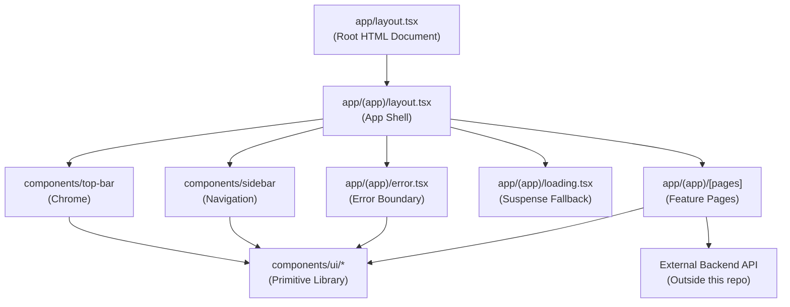

# `ai-agent-team` — Architecture

> A full-stack AI agent team management platform consisting of a Next.js frontend that enables users to create, configure, and monitor autonomous AI agents. The system provides a structured UI for composing multi-agent workflows, observing agent activity, and managing team-level configuration.

---

## Module Identity

| Attribute | Value |
|-----------|-------|
| **Path** | `/` |
| **Owner** | Platform Team |
| **Status** | Active — Early Development |
| **Since** | v0.1.0 |

---

## Table of Contents

- [Responsibility & Boundaries](#responsibility--boundaries)
- [Public Interface](#public-interface)
- [Internal Architecture](#internal-architecture)
- [Data Models](#data-models)
- [Key Algorithms & Patterns](#key-algorithms--patterns)
- [Error Handling Strategy](#error-handling-strategy)
- [Testing Strategy](#testing-strategy)
- [Performance Characteristics](#performance-characteristics)
- [Dependencies](#dependencies)
- [Design Decisions](#design-decisions)
- [Open Questions & Technical Debt](#open-questions--technical-debt)

---

## Responsibility & Boundaries

### What This Module Owns

This repository owns the complete user-facing frontend application for the AI agent team platform. Specifically:

- **Routing and page structure** — All URL-addressable pages, their layouts, loading states, and error boundaries under the Next.js App Router convention.
- **UI shell** — The persistent application chrome: sidebar navigation, top bar, and main content region.
- **Agent management views** — Pages for listing, creating, editing, and monitoring AI agents and agent teams.
- **Frontend configuration** — Next.js, TypeScript, Prettier, and related build/lint tooling configuration.
- **Containerized local development** — `docker-compose.yml` orchestration for running the full stack locally.

### What This Module Does NOT Own

- **AI agent execution and orchestration** — The runtime logic for running agents, managing their state machines, or dispatching tasks is owned by backend services not present in this repository.
- **Authentication and session management** — Identity, token issuance, and session lifecycle are handled by an external auth service; the frontend consumes its API only.
- **Data persistence** — No database schema or storage layer is defined here. All persistence is delegated to backend APIs.
- **Agent capability definitions** — The set of tools, skills, or capabilities available to agents is defined in backend configuration, not in this frontend.

### Contract With Consumers

This is a user-facing application; its primary "consumers" are end users via a browser. The application guarantees:

- Pages within the `(app)` route group are always wrapped in the full shell layout (sidebar + top bar).
- Any page-level data loading failure is caught by the nearest error boundary and presents a recoverable error UI — partial or broken page states are never silently presented to the user.
- Shared UI primitives exported from `components/ui/` conform to a stable internal API; pages depend only on these primitives, not on ad-hoc inline implementations.

---

## Public Interface

The surface area this module exposes. For a Next.js application, the public interface is the set of URL routes and any importable component/utility packages.

### Exports

| Export | Type | Description |
|--------|------|-------------|
| `/` (root) | Next.js Page | Application entry point; redirects or renders the default authenticated view |
| `/(app)/*` | Next.js Route Group | All authenticated application pages rendered within the app shell layout |
| `components/ui/*` | React Components | Shared, unstyled-or-lightly-styled primitive components (Button, etc.) consumed by all pages |
| `components/sidebar` | React Component | Persistent left-hand navigation component |
| `components/top-bar` | React Component | Persistent top chrome bar component |

### Entry Points

```tsx
// Root application shell — frontend/app/(app)/layout.tsx
export default function AppLayout({ children }: { children: React.ReactNode }) {
  return (
    <div className="flex h-screen overflow-hidden">
      <div className="hidden md:block">
        <Sidebar />
      </div>
      <div className="flex flex-1 flex-col overflow-hidden">
        <TopBar />
        <main id="main-content" className="flex-1 overflow-y-auto p-4 sm:p-6" role="main">
          {children}
        </main>
      </div>
    </div>
  );
}

// Shared primitive — frontend/components/ui/button.tsx
// Consumed by error boundaries and pages alike.
import { Button } from "@/components/ui/button";
```

---

## Internal Architecture

### Component Breakdown

```
frontend/
├── app/                        # Next.js App Router root
│   ├── (app)/                  # Route group: authenticated shell pages
│   │   ├── layout.tsx          # App shell — Sidebar + TopBar + main content slot
│   │   ├── loading.tsx         # Suspense fallback for all (app) pages — skeleton shimmer
│   │   ├── error.tsx           # Error boundary for all (app) pages — recovery UI
│   │   └── [pages]/            # Individual feature pages (agents, teams, settings, etc.)
│   ├── layout.tsx              # Root HTML document layout — font loading, global CSS
│   └── globals.css             # Global CSS custom properties, Tailwind base
├── components/
│   ├── sidebar.tsx             # Left navigation component — route links, agent list
│   ├── top-bar.tsx             # Top chrome — breadcrumbs, user menu, notifications
│   └── ui/                     # Primitive component library (shadcn/ui or equivalent)
│       ├── button.tsx          # Button primitive consumed across all surfaces
│       └── [other primitives]  # Input, Dialog, Badge, etc.
├── public/                     # Static assets served directly by Next.js
├── AGENTS.md                   # Agent/AI assistant guidance for Next.js conventions
├── CLAUDE.md                   # AI assistant config — delegates to AGENTS.md
├── next.config.*               # Next.js build and runtime configuration
├── tailwind.config.*           # Tailwind CSS theme and plugin configuration
├── tsconfig.json               # TypeScript compiler configuration
└── package.json                # Dependency manifest and scripts
```

```
(repository root)
├── frontend/                   # Next.js application (see above)
├── docker-compose.yml          # Local dev orchestration (frontend + backend services)
├── CLAUDE.md                   # Repo-level AI assistant guidance
├── CHANGELOG.md                # Version history
└── README.md                   # Project overview and onboarding
```

### Internal Component Relationships



### Key Abstractions

#### Route Group `(app)`

**What it represents:** The authenticated section of the application. All routes under this group share the persistent shell layout (sidebar + top bar). The parenthesized directory name is a Next.js convention that groups routes without affecting the URL path.

**Core invariant:** Every page rendered within this group is guaranteed to have the navigation sidebar and top bar present. No page in this group renders as a standalone full-screen experience.

**Lifecycle:** The layout is mounted once on initial navigation into the group and persists across client-side navigations within it. It is unmounted only when navigating to a route outside the group (e.g., a login page or a public route).

#### `components/ui/` Primitive Library

**What it represents:** A collection of low-level, reusable React components (buttons, inputs, dialogs, badges, etc.) that encode the design system's visual language. These are the only components that directly implement styling tokens from the CSS custom property system.

**Core invariant:** Feature pages and layout components must not implement their own ad-hoc styled primitives. All interactive or styled elements must be composed from this library. This ensures visual and behavioral consistency across the application.

**Lifecycle:** Components in this library are stateless or minimally stateful (e.g., a dropdown managing its own open/closed state). They do not fetch data and do not depend on application-level context.

#### CSS Custom Property Design System

**What it represents:** The visual design system is implemented as CSS custom properties (e.g., `--color-text-primary`, `--color-bg-tertiary`, `--color-danger`, `--radius-md`) defined in `globals.css`. Components reference these tokens rather than raw color or size values.

**Core invariant:** No hardcoded color hex values or pixel measurements appear in component code. All visual values are resolved through the token system, enabling theming (e.g., dark mode) by swapping the token definitions.

**Lifecycle:** Tokens are defined on the `:root` or a theme class at the document level and are available globally throughout the component tree.

---

## Data Models

### `AppLayoutProps`

The props interface for the authenticated shell layout, establishing the content projection pattern used throughout the application.

```typescript
interface AppLayoutProps {
  children: React.ReactNode;
}
```

**Validation rules:**
- `children` must be a valid React node; Next.js guarantees this via the App Router page convention.

### `AppErrorProps`

The props interface for the route-group-level error boundary component, matching Next.js's error boundary contract.

```typescript
interface AppErrorProps {
  error: Error & { digest?: string };
  reset: () => void;
}
```

**Validation rules:**
- `error.message` is displayed to the user if present; a fallback message is shown if the string is empty.
- `error.digest` is an optional opaque string provided by Next.js for server-side error correlation; it is not currently displayed in the UI but should be logged.
- `reset` is a function provided by Next.js that re-renders the segment — it must not be called on mount, only in response to user interaction.

---

## Key Algorithms & Patterns

### Responsive Shell Layout

**Purpose:** Provide a full-application shell that adapts between mobile, tablet, and desktop viewports without JavaScript-driven layout shifts.

**Approach:** Uses Tailwind CSS responsive prefixes to conditionally show/hide and resize layout regions. The sidebar is hidden entirely below `md` breakpoint (`hidden md:block`), shown as an icon-only rail at `md`, and as a full labeled sidebar at `lg`. The main content area uses `flex-1` to fill remaining horizontal space at all breakpoints.

**Complexity:** O(1) — pure CSS, no runtime computation.

**Trade-offs:** Sidebar state (collapsed vs. expanded) at desktop sizes would require either CSS-only tricks or a small piece of client-side state. Mobile navigation (hamburger/drawer) is not yet implemented and requires a separate client component with toggle state.

### Suspense-First Data Loading

**Purpose:** Provide instant visual feedback during page transitions and data fetches without blocking the render of the application shell.

**Approach:** The `loading.tsx` file at the `(app)` route group level acts as a Suspense boundary fallback for all pages in the group. It renders a skeleton shimmer using CSS `animate-pulse` on placeholder `div` elements sized to approximate the expected content. Next.js automatically wraps page components in a `<Suspense>` boundary backed by this file.

**Complexity:** O(1) — static render, no data dependencies.

**Trade-offs:** A single loading UI at the route group level is a coarse granularity. Individual pages with distinct content shapes would benefit from their own `loading.tsx` files at the page level for more accurate skeleton fidelity.

### Error Boundary with Recovery

**Purpose:** Prevent a single page-level error from crashing the entire application shell and provide the user a path to recovery.

**Approach:** The `error.tsx` file at the `(app)` route group level is a Next.js Client Component that implements the React error boundary pattern. It receives the thrown `error` and a `reset` callback from Next.js. The UI presents an alert icon, a human-readable error message, and a "Try again" button that calls `reset()` to re-attempt rendering the failed segment.

**Complexity:** O(1) — no computation, pure UI response to caught error.

**Trade-offs:** The error boundary catches errors in page components but not in the layout itself (Sidebar, TopBar). Layout-level errors would propagate to the root error boundary. Error details (including `digest` for server errors) are not currently sent to an error reporting service.

---

## Error Handling Strategy

### Error Types Produced

| Error Code | Condition | Severity | Consumer Action |
|------------|-----------|----------|----------------|
| `PAGE_RENDER_ERROR` | An unhandled exception is thrown during React rendering of a page component | High | `error.tsx` boundary catches and displays recovery UI; user can press "Try again" |
| `DATA_FETCH_ERROR` | A server component or client-side fetch fails while loading page data | High | Same as PAGE_RENDER_ERROR — surfaces through the error boundary |
| `NETWORK_ERROR` | API calls from client components fail due to connectivity | Medium | Currently unhandled at framework level; individual pages are responsible for their own fetch error states |

### Error Propagation

Errors thrown during server-side rendering of page components are caught by Next.js and forwarded to the nearest `error.tsx` boundary in the component tree. The `(app)/error.tsx` boundary is the primary catch point for all authenticated pages.

The `error.tsx` component receives the error and a `reset` function. On user-initiated reset, Next.js re-renders the page segment from scratch. If the error persists (e.g., a backend outage), the boundary will catch again and display the same recovery UI — there is currently no max-retry limit or escalation path (see Tech Debt).

Client-side fetch errors within page components are not yet standardized. Each page is expected to handle its own loading/error states for data it fetches after hydration. A global error reporting integration (e.g., Sentry) has not yet been wired up; `error.digest` values are available for server error correlation when it is.

---

## Testing Strategy

### Test Coverage Goals

| Category | Coverage Target | Current | Notes |
|----------|----------------|---------|-------|
| Unit Tests | 80% | ~0% | No test files present yet; framework not confirmed (likely Jest + React Testing Library) |
| Integration Tests | 60% | ~0% | Playwright config directory referenced in `.gitignore` — E2E framework is chosen but not yet implemented |
| Edge Cases | — | — | Error boundary recovery, mobile layout, empty states, API failure modes |

### Key Test Scenarios

- **Shell layout renders on all breakpoints:** Verify that the sidebar is hidden at mobile widths, visible at desktop widths, and that the main content area fills the remaining space correctly.
- **Error boundary recovery:** Render a page that throws, assert the error UI is displayed, simulate clicking "Try again", assert the page re-renders (or the error UI reappears if the error is persistent).
- **Loading skeleton renders during suspense:** Wrap a page component that suspends in a test Suspense boundary and assert the skeleton shimmer elements are present.
- **Navigation links in Sidebar:** Assert that each nav item renders the correct `href` and that the active item is visually indicated when the route matches.
- **Button component accessibility:** Verify that `Button` renders a focusable, keyboard-activatable element with correct ARIA attributes.

### Mocking Boundaries

- **Backend API calls** are mocked at the `fetch` level (via `msw` or `jest.mock`) in unit and integration tests. Real HTTP calls are made only in dedicated E2E tests running against a local `docker-compose` stack.
- **Next.js router** (`useRouter`, `usePathname`, etc.) is mocked in unit tests for components that depend on route state (e.g., the Sidebar active-item logic).
- **CSS custom properties** do not require mocking but do require a JSDOM environment that tolerates unresolved CSS variables; assertions should target structural/semantic attributes rather than computed styles.

---

## Performance Characteristics

| Metric | Expected | Measured | Notes |
|--------|----------|----------|-------|
| Initial page load (LCP) | < 2.5 s | Not yet measured