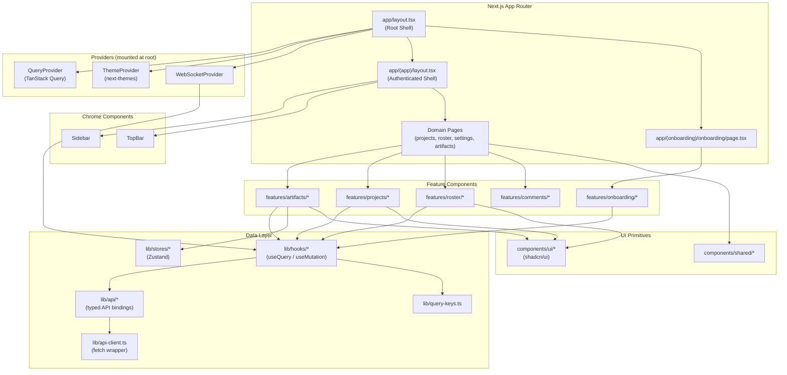

# `ai-agent-team/frontend` — Architecture

> Next.js 14+ App Router frontend for the AI Agent Team platform. Provides a multi-page interface for managing AI agent rosters, projects, artifacts, and workspace settings. Communicates with a backend API over HTTP and WebSocket.

---

## Module Identity

| Attribute | Value |
|-----------|-------|
| **Path** | `frontend/` |
| **Owner** | Platform Team |
| **Status** | Active |
| **Since** | v1.0 |

---

## Table of Contents

- [Responsibility & Boundaries](#responsibility--boundaries)
- [Public Interface](#public-interface)
- [Internal Architecture](#internal-architecture)
- [Data Models](#data-models)
- [Key Algorithms & Patterns](#key-algorithms--patterns)
- [Error Handling Strategy](#error-handling-strategy)
- [Testing Strategy](#testing-strategy)
- [Performance Characteristics](#performance-characteristics)
- [Dependencies](#dependencies)
- [Design Decisions](#design-decisions)
- [Open Questions & Technical Debt](#open-questions--technical-debt)

---

## Responsibility & Boundaries

### What This Module Owns

- All browser-rendered UI: routing, page layouts, and React component trees.
- Client-side state management via TanStack Query (server cache) and Zustand stores (ephemeral UI state).
- HTTP API client (`lib/api-client.ts`) responsible for constructing, dispatching, and normalising responses from the backend REST API.
- Domain-specific API bindings in `lib/api/` that map backend endpoints to typed TypeScript functions.
- React Query hooks in `lib/hooks/` that wrap API bindings with caching, invalidation, and loading/error states.
- Real-time event subscription via WebSocket (`components/websocket-provider.tsx`, `lib/hooks/use-websocket.ts`).
- Onboarding flow rendered in the `(onboarding)` route group, gated separately from the main authenticated shell.
- End-to-end test suite in `e2e/` covering all major user journeys.

### What This Module Does NOT Own

- Business logic execution, AI model inference, or agent orchestration — all handled by the backend service.
- Authentication token issuance — the frontend consumes tokens but does not issue or store them beyond the HTTP client.
- Persistent data storage — the backend owns all durable state; the frontend treats its cache as ephemeral.
- CI/CD pipeline configuration — defined outside this module.

### Contract With Consumers

This module is a self-contained deployable application. Its only external contract is the backend REST and WebSocket API. Page routes are stable URLs surfaced to end users and must not be removed without redirect handling. The `lib/types/api.ts` file defines the authoritative TypeScript shapes for all API payloads; consumers of shared types should import from there.

---

## Public Interface

The surface area this module exposes. Consumers should depend only on these exports.

### Exports

| Export | Type | Description |
|--------|------|-------------|
| `GET /` | Route | Root redirect — sends authenticated users to `/projects`, unauthenticated users to `/onboarding` |
| `GET /onboarding` | Route | First-time setup wizard |
| `GET /projects` | Route | Project listing page |
| `GET /projects/[projectId]` | Route | Project overview with tab navigation |
| `GET /projects/[projectId]/brief` | Route | Project brief editor |
| `GET /projects/[projectId]/documents` | Route | Document manager |
| `GET /projects/[projectId]/artifacts/new` | Route | New artifact creation with smart brief form |
| `GET /projects/[projectId]/artifacts/[artifactId]` | Route | Artifact review and version management |
| `GET /roster` | Route | Agent roster list |
| `GET /roster/[agentId]` | Route | Agent detail with tabs |
| `GET /settings` | Route | Settings overview |
| `GET /settings/git` | Route | Git provider configuration |
| `GET /settings/mcp` | Route | MCP server configuration |
| `GET /settings/usage` | Route | Usage metrics |
| `GET /settings/workspace` | Route | Workspace configuration |
| `lib/api/index.ts` | Module re-export | Unified export of all typed API functions |
| `lib/types/api.ts` | Type definitions | Canonical API payload types |
| `lib/query-keys.ts` | Constants | Centralised TanStack Query key factory |

### Entry Points

```typescript
// Root layout — wraps the entire application
// app/layout.tsx
export default function RootLayout({ children }: { children: React.ReactNode })

// App shell layout — authenticated pages
// app/(app)/layout.tsx
export default function AppLayout({ children }: { children: React.ReactNode })

// Onboarding layout — unauthenticated setup flow
// app/(onboarding)/onboarding/page.tsx
export default function OnboardingPage()

// Unified API module
// lib/api/index.ts
export * from "./artifacts";
export * from "./git-providers";
export * from "./mcp";
export * from "./onboarding";
export * from "./projects";
export * from "./roster";
export * from "./usage";
export * from "./workspace";
```

---

## Internal Architecture

### Component Breakdown

```
frontend/
├── app/                        # Next.js App Router — routing, layouts, pages
│   ├── layout.tsx              # Root HTML shell: fonts, global providers, CSS vars
│   ├── page.tsx                # Root redirect (/ → /projects or /onboarding)
│   ├── globals.css             # Global resets and Tailwind base layer
│   ├── tokens.css              # Design token CSS custom properties
│   ├── not-found.tsx           # 404 boundary
│   ├── (app)/                  # Authenticated route group — sidebar + top bar shell
│   │   ├── layout.tsx          # App chrome: Sidebar + TopBar + <main>
│   │   ├── error.tsx           # React error boundary for the app group
│   │   ├── loading.tsx         # Suspense skeleton for the app group
│   │   ├── projects/           # Project domain pages
│   │   ├── roster/             # Agent roster pages
│   │   └── settings/           # Settings pages (git, mcp, usage, workspace)
│   └── (onboarding)/           # Unauthenticated onboarding flow route group
│       └── onboarding/
│           └── page.tsx        # Onboarding wizard page
├── features/                   # Domain feature components (not directly routed)
│   ├── artifacts/              # Artifact review, diff viewer, version switcher, heartbeat
│   ├── comments/               # Inline comment toolbar
│   ├── onboarding/             # Onboarding form and roster preview
│   ├── projects/               # Project card, brief editor, document manager, create dialog
│   └── roster/                 # Agent card, detail tabs, add-agent dialog, research dialog
├── components/                 # Shared, domain-agnostic components
│   ├── ui/                     # Primitive UI components (shadcn/ui wrappers)
│   ├── sidebar.tsx             # App navigation sidebar
│   ├── top-bar.tsx             # Top navigation bar
│   ├── query-provider.tsx      # TanStack Query client provider
│   ├── theme-provider.tsx      # next-themes dark/light mode provider
│   ├── websocket-provider.tsx  # WebSocket connection lifecycle provider
│   └── shared/
│       └── cursor-pagination.tsx  # Reusable cursor-based pagination controls
├── lib/                        # Non-visual logic: API, hooks, stores, types
│   ├── api-client.ts           # Base HTTP client (fetch wrapper, error normalisation)
│   ├── api/                    # Domain-scoped API binding modules
│   │   ├── artifacts.ts        # Artifact CRUD + review operations
│   │   ├── git-providers.ts    # Git provider configuration
│   │   ├── mcp.ts              # MCP server management
│   │   ├── onboarding.ts       # Onboarding submission
│   │   ├── projects.ts         # Project CRUD
│   │   ├── roster.ts           # Agent roster CRUD
│   │   ├── usage.ts            # Usage metrics
│   │   ├── workspace.ts        # Workspace settings
│   │   └── index.ts            # Barrel re-export
│   ├── hooks/                  # TanStack Query hooks (data-fetching + mutation)
│   │   ├── use-artifacts.ts
│   │   ├── use-git-providers.ts
│   │   ├── use-onboarding.ts
│   │   ├── use-projects.ts
│   │   ├── use-roster.ts
│   │   ├── use-settings.ts
│   │   ├── use-text-selection.ts
│   │   └── use-websocket.ts
│   ├── stores/                 # Zustand ephemeral UI stores
│   │   ├── selection-store.ts  # Text/item selection state
│   │   └── ui-store.ts         # Global UI state (modals, panels, drawer open)
│   ├── query-keys.ts           # Centralised TanStack Query key factory
│   ├── types/
│   │   └── api.ts              # Canonical API payload TypeScript types
│   ├── theme.ts                # Theme token utilities
│   └── utils.ts                # Generic utility functions (cn, etc.)
└── e2e/                        # Playwright end-to-end tests
    ├── smoke.spec.ts
    ├── onboarding.spec.ts
    ├── projects.spec.ts
    ├── roster.spec.ts
    ├── artifact.spec.ts
    └── settings.spec.ts
```

### Internal Component Relationships



### Key Abstractions

#### Route Groups — `(app)` and `(onboarding)`

**What it represents:** Next.js route groups partition the URL namespace into two distinct shells without affecting the URL path. `(app)` renders the full authenticated chrome (sidebar + top bar). `(onboarding)` renders a bare page without navigation.

**Core invariant:** Every page requiring navigation chrome must live under `(app)/`. Pages that must be reachable before workspace setup must live under `(onboarding)/`.

**Lifecycle:** Resolved at build time by Next.js file-system routing. Cannot be changed at runtime.

---

#### API Client — `lib/api-client.ts`

**What it represents:** A thin typed wrapper around the browser `fetch` API. Handles base URL resolution, default headers, JSON serialisation, and normalises HTTP error responses into thrown `Error` instances with structured metadata.

**Core invariant:** All network calls from the application flow through this module. No feature component calls `fetch` directly.

**Lifecycle:** Instantiated once (module singleton). Consumed by all `lib/api/*.ts` binding modules.

---

#### TanStack Query Hooks — `lib/hooks/*`

**What it represents:** The single source of truth for all server-fetched data in the component tree. Each hook encapsulates the query key, the fetcher function, caching policy, and any associated mutations with cache invalidation.

**Core invariant:** Components never manage their own fetch lifecycle (`isLoading`, `data`, `error`). They receive these from a hook. Mutations invalidate the relevant query keys after success.

**Lifecycle:** Hooks are called inside React components. The underlying cache lives in the `QueryClient` mounted by `QueryProvider` at the root.

---

#### Zustand Stores — `lib/stores/*`

**What it represents:** Lightweight client-only state that is not derived from server data and does not need to survive navigation. Currently: `ui-store` (modal/panel open states) and `selection-store` (current text or item selection used by the floating comment toolbar).

**Core invariant:** Stores hold only ephemeral UI state. Any data that originates from the API must live in TanStack Query, not in a Zustand store.

**Lifecycle:** Created at module load time (Zustand singleton pattern). Reset implicitly when the page is refreshed.

---

#### WebSocket Provider — `components/websocket-provider.tsx`

**What it represents:** A React context provider that manages a single persistent WebSocket connection to the backend. Distributes real-time events to subscribers (primarily `use-websocket` hook consumers) without each component managing its own connection.

**Core invariant:** Exactly one WebSocket connection exists per browser tab. Components subscribe to event types; they never open their own connections.

**Lifecycle:** Mounted at the root layout. Connects on mount, reconnects on transient failures, disconnects on unmount.

---

## Data Models

Key data structures owned by this module.

### `ApiError`

Normalised error thrown by `lib/api-client.ts` for all non-2xx responses.

```typescript
interface ApiError extends Error {
  status: number;       // HTTP status code
  code?: string;        // Application-level error code from response body
  detail?: string;      // Human-readable detail message
}
```

**Validation rules:**
- `status` is always set from the HTTP response status.
- `code` and `detail` are populated only when the backend returns a structured error body.

---

### `Project`

Core project entity as returned by the backend.

```typescript
interface Project {
  id: string;
  name: string;
  description?: string;
  status: "active" | "archived";
  createdAt: string;   // ISO 8601
  updatedAt: string;   // ISO 8601
}
```

**Validation rules:**
- `id` is a non-empty string (UUID).
- `status` must be one of the enumerated literals.

---

### `Agent`

Agent entity representing a member of the AI agent roster.

```typescript
interface Agent {
  id: string;
  name: string;
  role